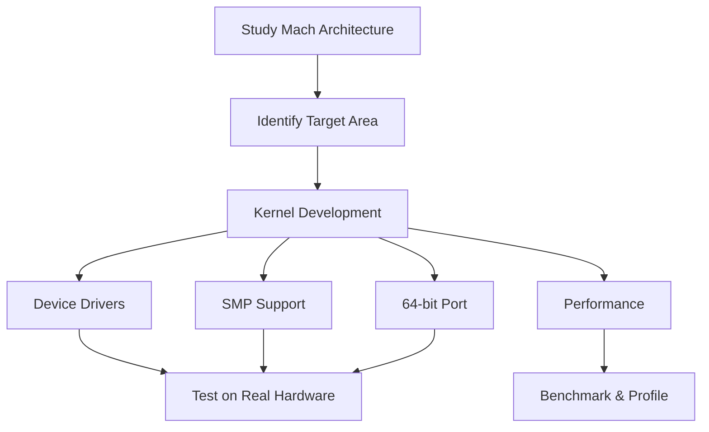
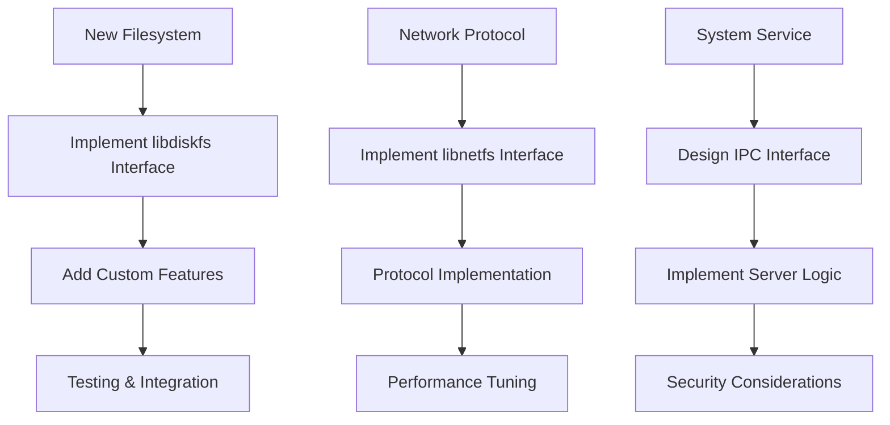
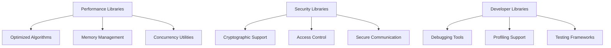
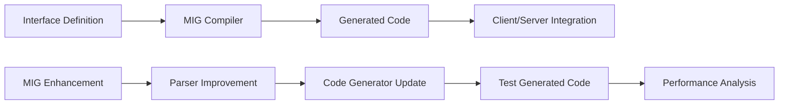
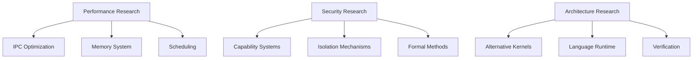
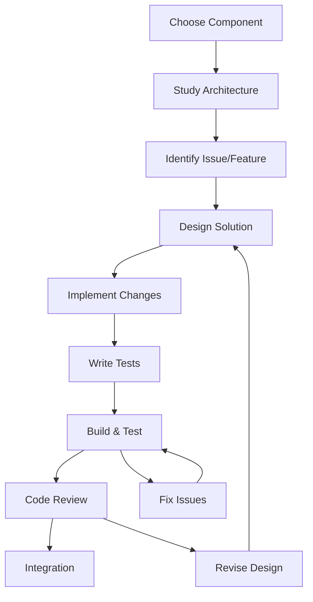
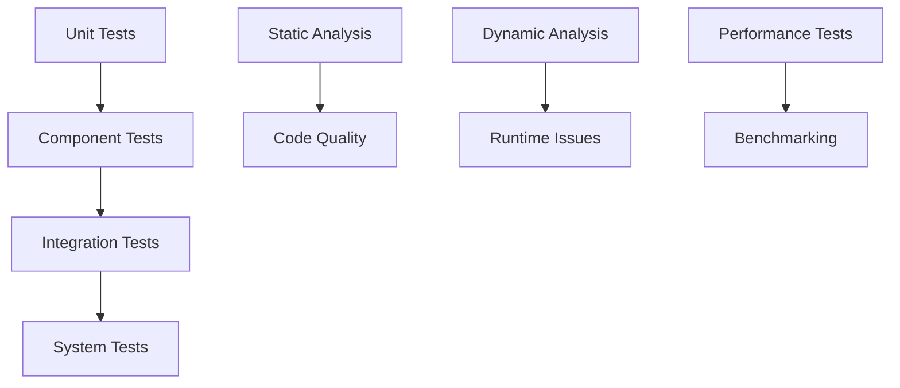
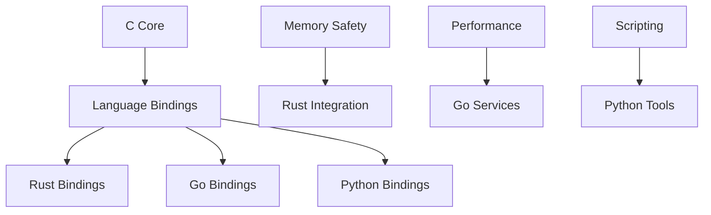

# GNU Hurd Development Pathways

## Overview
This document outlines the development pathways and opportunities within the GNU Hurd ecosystem integrated into the 9nu monorepo.

## Development Areas

### 1. Microkernel Development (GNU Mach)
**Location**: `hurd-ecosystem/kernel/gnumach/`

#### Current Opportunities
- **SMP Support**: Multi-processor support enhancement
- **64-bit Port**: Complete x86_64 architecture support  
- **Device Drivers**: Modern hardware support
- **Performance**: IPC optimization, scheduling improvements
- **Memory Management**: Enhanced virtual memory system

#### Development Path


#### Skills Required
- Low-level C programming
- Assembly language (x86/x86_64)
- Operating system concepts
- Hardware interface knowledge

### 2. Server Development
**Locations**: Root level + `hurd-ecosystem/servers/`

#### Core Servers
- **Filesystem Servers**: ext2fs, fatfs, unionfs, nfs
- **Network Servers**: pfinet (TCP/IP), pflocal (Unix sockets)
- **System Servers**: auth, proc, exec, init

#### Development Opportunities


#### Example: New Filesystem Server
1. **Design Phase**: Define filesystem format and features
2. **Interface Design**: Create MIG interface definitions
3. **Implementation**: Use libdiskfs framework
4. **Testing**: Create test suite for filesystem
5. **Integration**: Add to build system and documentation

### 3. Library Development
**Locations**: `lib*/` + `hurd-ecosystem/libraries/`

#### Core Libraries
- **libpthread**: Threading implementation
- **libdiskfs**: Disk filesystem framework
- **libnetfs**: Network filesystem framework
- **libports**: Port management
- **libstore**: Storage abstraction

#### Development Areas


### 4. Interface Development (MIG)
**Location**: `hurd-ecosystem/tools/mig/`

#### MIG Enhancement Opportunities
- **Code Generation**: Improved generated code efficiency
- **Language Bindings**: Support for other languages
- **Interface Analysis**: Static analysis tools
- **Documentation**: Auto-generated interface docs

#### Development Process


### 5. Experimental Development
**Location**: `hurd-ecosystem/experimental/`

#### Incubator Projects
- **New Server Architectures**: Experimental designs
- **Performance Prototypes**: New optimization approaches
- **Security Enhancements**: Advanced security models
- **Modern Language Support**: Rust, Go integration

#### Viengoos (L4-based Hurd)
- **L4 Integration**: Alternative microkernel support
- **Performance Research**: Comparing architectures
- **Formal Verification**: Research into provable systems

#### Research Areas


## Development Workflow

### Setting Up Development Environment
```bash
# 1. Clone and setup repository
git clone https://github.com/Unicorn-Dynamics/9nu.git
cd 9nu

# 2. Install dependencies (on Hurd system)
sudo apt-get install build-essential autotools-dev

# 3. Configure build system
./configure

# 4. Build specific component
cd hurd-ecosystem/kernel/gnumach
make

# 5. Build entire system
cd ../../..
make
```

### Development Cycle


### Testing Strategy


## Contribution Pathways

### For New Developers
1. **Start Small**: Fix bugs, improve documentation
2. **Learn Architecture**: Study existing servers and libraries
3. **Contribute Tests**: Add test coverage for existing code
4. **Improve Tools**: Enhance build system, debugging tools

### For Experienced Developers
1. **Performance Work**: Profile and optimize critical paths
2. **New Features**: Implement missing POSIX functionality
3. **Security Enhancements**: Improve privilege separation
4. **Hardware Support**: Add device drivers

### For Researchers
1. **Experimental Projects**: Use incubator for new ideas
2. **Formal Methods**: Apply verification techniques
3. **Alternative Architectures**: Explore viengoos improvements
4. **Performance Analysis**: Deep system performance studies

## Specific Project Ideas

### Short-term Projects (1-3 months)
- **Improve Documentation**: Add API documentation, tutorials
- **Testing Framework**: Create comprehensive test suite
- **Build System**: Streamline compilation process
- **Debugging Tools**: Enhanced GDB support for Hurd

### Medium-term Projects (3-12 months)
- **New Filesystem**: Implement modern filesystem (ZFS-like)
- **Network Stack**: IPv6 support, modern protocols
- **Package Manager**: Native Hurd package management
- **Development Tools**: IDE integration, language support

### Long-term Projects (1+ years)
- **SMP Support**: Complete multiprocessor implementation
- **64-bit Port**: Full x86_64 architecture support
- **Virtualization**: Container/VM support for Hurd
- **Formal Verification**: Verified microkernel implementation

## Technology Integration

### Modern Language Support


### Build System Evolution
- **Current**: GNU Autotools + Make
- **Enhancements**: CMake integration, Ninja builds
- **Package Management**: Native dependency handling
- **Cross-compilation**: Improved toolchain support

### Continuous Integration


## Getting Started Guide

### 1. Choose Your Path
- **System Programming**: Work on kernel, servers, libraries
- **Tools Development**: Improve MIG, build system, utilities
- **Research**: Experimental projects, performance analysis
- **Documentation**: Improve guides, create tutorials

### 2. Learn the Codebase
- Read architecture documentation
- Study existing implementations
- Run and debug the system
- Understand IPC mechanisms

### 3. Start Contributing
- Join development discussions
- Pick up beginner-friendly issues
- Submit patches for review
- Help with testing and documentation

### 4. Advanced Development
- Design new components
- Lead major features
- Mentor new contributors
- Shape project direction

## Resources for Developers

### Documentation
- **Architecture Guide**: `HURD_ARCHITECTURE.md`
- **Build Instructions**: `INSTALL`, `INSTALL-cross`
- **Component READMEs**: Individual component documentation
- **Interface Reference**: MIG-generated documentation

### Development Tools
- **GDB**: Debugging support for Hurd
- **Profiling**: Performance analysis tools
- **Static Analysis**: Code quality tools
- **Version Control**: Git workflow and practices

### Community
- **Mailing Lists**: development discussions
- **IRC**: real-time help and collaboration
- **Bug Tracker**: issue tracking and assignment
- **Code Review**: patch review process

## Conclusion

The GNU Hurd provides unique opportunities for operating system development, combining the benefits of microkernel architecture with the flexibility of user-space servers. This monorepo structure enables coordinated development across all components while preserving the modular design that makes Hurd distinctive.

Whether you're interested in low-level kernel development, high-level server implementation, or research into new operating system architectures, the Hurd ecosystem offers pathways for meaningful contribution to a truly free and innovative operating system.