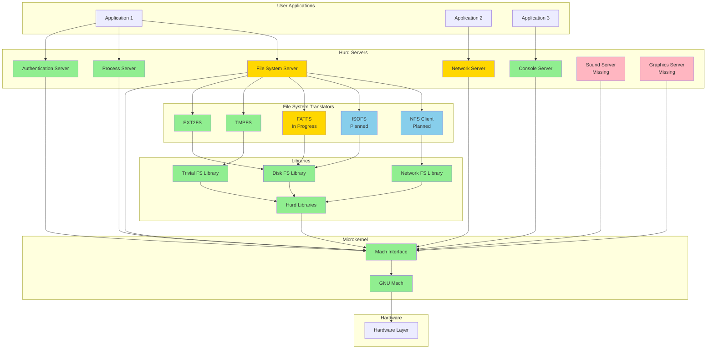
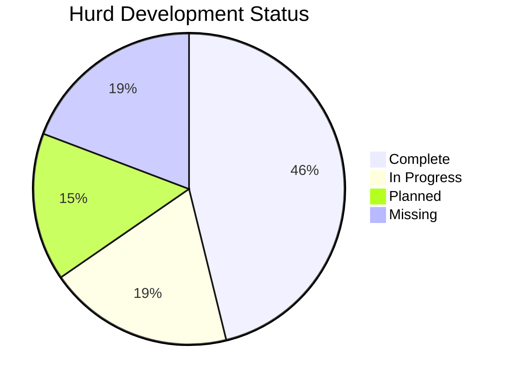
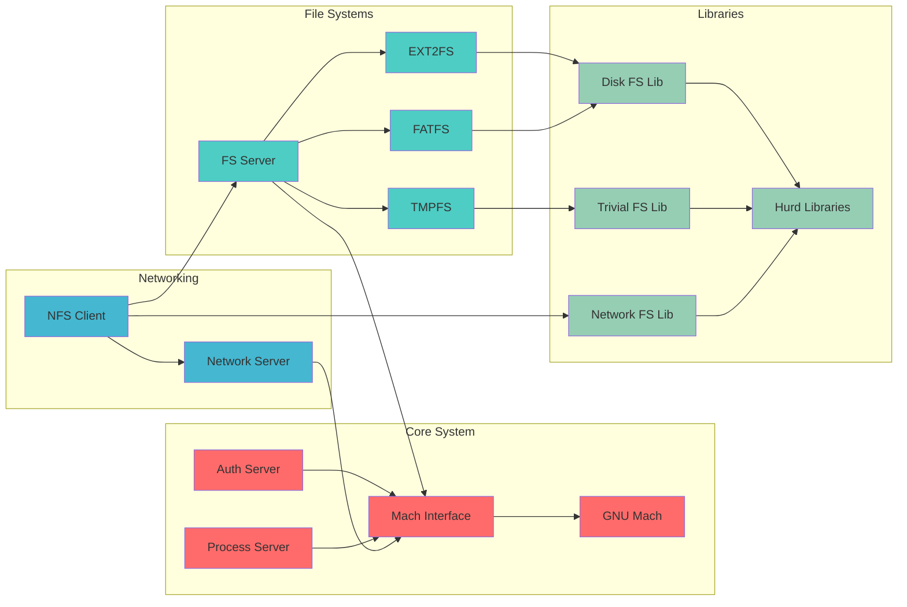
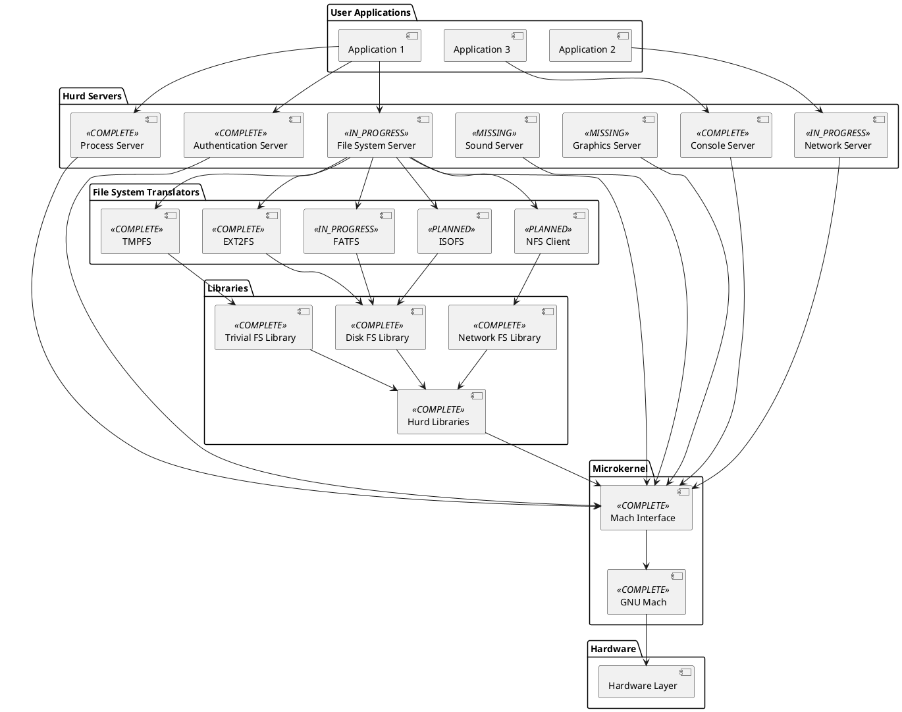

# Hurd Development Roadmap

*Generated on: 2025-07-31 07:38:51 UTC*

## Overview

This roadmap provides a comprehensive view of the Hurd operating system development status, architecture, and future plans. The Hurd is a microkernel-based operating system that implements the POSIX API on top of the GNU Mach microkernel.

## Architecture Overview

### System Architecture



### Development Status



### Component Dependencies



## Detailed Architecture (PlantUML)



## Development Roadmap

```plantuml
@startuml Hurd Development Roadmap

!define COMPLETE_COLOR #90EE90
!define INPROGRESS_COLOR #FFD700
!define PLANNED_COLOR #87CEEB
!define MISSING_COLOR #FFB6C1

roadmap "Hurd Development Timeline" {
    title Hurd Development Roadmap
    
    now -> 2024 Q1 : Current Status
    2024 Q1 -> 2024 Q2 : Phase 1
    2024 Q2 -> 2024 Q3 : Phase 2
    2024 Q3 -> 2024 Q4 : Phase 3
    2024 Q4 -> 2025 Q1 : Phase 4
}

package "Phase 1 - Core Stability" {
    [Complete File System Server] <<IN_PROGRESS>>
    [Enhance Network Server] <<IN_PROGRESS>>
    [Performance Optimizations] <<IN_PROGRESS>>
    [Security Enhancements] <<PLANNED>>
}

package "Phase 2 - Missing Components" {
    [Sound Server Implementation] <<MISSING>>
    [Graphics Server Implementation] <<MISSING>>
    [USB Support] <<MISSING>>
    [Wireless Networking] <<MISSING>>
}

package "Phase 3 - Advanced Features" {
    [Virtualization Support] <<PLANNED>>
    [Power Management] <<MISSING>>
    [Bluetooth Support] <<MISSING>>
    [Advanced File Systems] <<PLANNED>>
}

package "Phase 4 - Polish & Documentation" {
    [Comprehensive Testing] <<PLANNED>>
    [Complete Documentation] <<IN_PROGRESS>>
    [User Experience Improvements] <<PLANNED>>
    [Performance Tuning] <<IN_PROGRESS>>
}

@enduml
```

## Component Status

| Component | Status | Priority | Category | Dependencies |
|-----------|--------|----------|----------|--------------|
| GNU Mach Microkernel | ✅ Complete | 🔴 High | Microkernel | None |
| Mach Interface | ✅ Complete | 🔴 High | Microkernel | gnumach |
| Authentication Server | ✅ Complete | 🔴 High | Servers | mach_interface |
| Process Server | ✅ Complete | 🔴 High | Servers | mach_interface, auth |
| File System Server | 🔄 In-Progress | 🔴 High | Servers | mach_interface, proc |
| Network Server | 🔄 In-Progress | 🟡 Medium | Servers | mach_interface |
| Console Server | ✅ Complete | 🟡 Medium | Servers | mach_interface |
| EXT2 File System | ✅ Complete | 🔴 High | Translators | fs |
| Temporary File System | ✅ Complete | 🟡 Medium | Translators | fs |
| FAT File System | 🔄 In-Progress | 🟢 Low | Translators | fs |
| ISO File System | 📋 Planned | 🟢 Low | Translators | fs |
| NFS Client | 📋 Planned | 🟡 Medium | Translators | fs, pfinet |
| Hurd Libraries | ✅ Complete | 🔴 High | Libraries | mach_interface |
| Trivial File System Library | ✅ Complete | 🔴 High | Libraries | libhurd |
| Network File System Library | ✅ Complete | 🟡 Medium | Libraries | libhurd |
| Disk File System Library | ✅ Complete | 🔴 High | Libraries | libhurd |
| Settrans Utility | ✅ Complete | 🔴 High | Utilities | libhurd |
| Showtrans Utility | ✅ Complete | 🟡 Medium | Utilities | libhurd |
| File System Options | ✅ Complete | 🟡 Medium | Utilities | libhurd |
| RPC Trace Tool | ✅ Complete | 🟢 Low | Tools | libhurd |
| Hurd Boot System | ✅ Complete | 🔴 High | Boot | gnumach, auth, proc |
| Sound Server | ❌ Missing | 🟡 Medium | Servers | mach_interface |
| Graphics Server | ❌ Missing | 🟡 Medium | Servers | mach_interface |
| Power Management | ❌ Missing | 🟢 Low | Servers | mach_interface |
| USB Support | ❌ Missing | 🟡 Medium | Servers | mach_interface |
| Bluetooth Support | ❌ Missing | 🟢 Low | Servers | mach_interface |
| Wireless Networking | ❌ Missing | 🟡 Medium | Servers | pfinet |
| Virtualization Support | 📋 Planned | 🟢 Low | Servers | mach_interface |
| Security Enhancements | 📋 Planned | 🔴 High | Security | auth |
| Performance Optimization | 🔄 In-Progress | 🔴 High | Optimization | gnumach, proc, fs |
| Comprehensive Documentation | 🔄 In-Progress | 🟡 Medium | Documentation | None |
| Testing Framework | 📋 Planned | 🟡 Medium | Testing | None |


## Development Phases

### Phase 1: Core Stability (2024 Q1-Q2)
**Focus:** Complete core system components and improve stability

**Objectives:**
- Complete File System Server implementation
- Enhance Network Server functionality
- Implement performance optimizations
- Add security enhancements
- Improve documentation coverage

**Key Components:**
- File System Server (in-progress)
- Network Server (in-progress)
- Performance Optimization (in-progress)
- Security Enhancements (planned)

### Phase 2: Missing Components (2024 Q2-Q3)
**Focus:** Implement missing core system components

**Objectives:**
- Implement Sound Server
- Implement Graphics Server
- Add USB device support
- Implement wireless networking support

**Key Components:**
- Sound Server (missing)
- Graphics Server (missing)
- USB Support (missing)
- Wireless Networking (missing)

### Phase 3: Advanced Features (2024 Q3-Q4)
**Focus:** Add advanced system features and capabilities

**Objectives:**
- Implement virtualization support
- Add power management capabilities
- Implement Bluetooth support
- Add advanced file system support

**Key Components:**
- Virtualization Support (planned)
- Power Management (missing)
- Bluetooth Support (missing)
- Advanced File Systems (planned)

### Phase 4: Polish & Documentation (2024 Q4-2025 Q1)
**Focus:** System polish, comprehensive testing, and documentation

**Objectives:**
- Implement comprehensive testing framework
- Complete documentation suite
- Improve user experience
- Final performance tuning

**Key Components:**
- Testing Framework (planned)
- Comprehensive Documentation (in-progress)
- User Experience Improvements (planned)
- Performance Tuning (in-progress)

## Priority Matrix

### High Priority Components
- File System Server (in-progress)
- Performance Optimization (in-progress)
- Security Enhancements (planned)
- Sound Server (missing)
- Graphics Server (missing)

### Medium Priority Components
- Network Server (in-progress)
- USB Support (missing)
- Wireless Networking (missing)
- Comprehensive Documentation (in-progress)
- Testing Framework (planned)

### Low Priority Components
- Virtualization Support (planned)
- Power Management (missing)
- Bluetooth Support (missing)
- Advanced File Systems (planned)

## Success Metrics

### Phase 1 Success Criteria
- [ ] File System Server reaches 90% completion
- [ ] Network Server reaches 80% completion
- [ ] Performance improvements of 20% or more
- [ ] Security audit completed
- [ ] Documentation coverage reaches 70%

### Phase 2 Success Criteria
- [ ] Sound Server implementation completed
- [ ] Graphics Server implementation completed
- [ ] USB support implemented
- [ ] Wireless networking support implemented
- [ ] All core components functional

### Phase 3 Success Criteria
- [ ] Virtualization support implemented
- [ ] Power management features added
- [ ] Bluetooth support implemented
- [ ] Advanced file system support added
- [ ] System stability maintained

### Phase 4 Success Criteria
- [ ] Comprehensive testing framework operational
- [ ] Complete documentation suite available
- [ ] User experience significantly improved
- [ ] Performance optimized
- [ ] System ready for production use

## Risk Assessment

### High Risk Items
- Graphics Server implementation (complex, requires significant resources)
- Sound Server implementation (requires hardware expertise)
- Performance optimization (may introduce regressions)

### Medium Risk Items
- USB support implementation
- Wireless networking support
- Virtualization support

### Low Risk Items
- Documentation improvements
- Testing framework development
- User experience enhancements

## Contributing

To contribute to the Hurd development:

1. Review the current status of components
2. Identify areas where you can contribute
3. Follow the development guidelines
4. Submit patches and improvements
5. Help with documentation and testing

## Resources

- [Hurd Official Website](https://www.gnu.org/software/hurd/)
- [Hurd Documentation](https://www.gnu.org/software/hurd/documentation.html)
- [Contributing Guidelines](https://www.gnu.org/software/hurd/contributing.html)
- [Source Repositories](https://www.gnu.org/software/hurd/source_repositories.html)

---

*This roadmap is automatically generated and updated regularly. For the most current information, please check the official Hurd documentation and development channels.*
