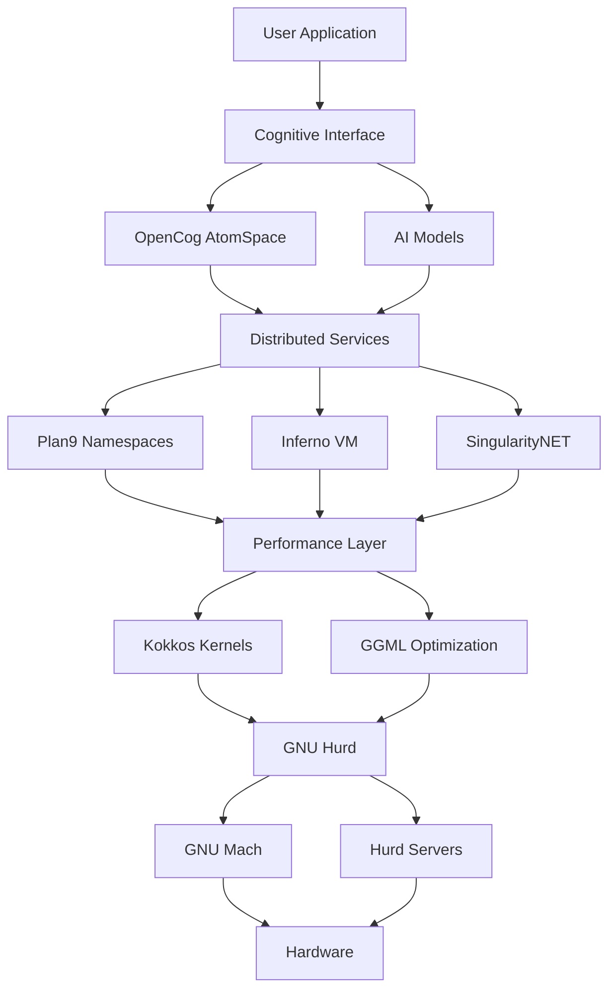

# GNU Hurd Cognitive Architecture Development Roadmap

**Project:** GNU Hurd Cognitive Microkernel Operating System  
**Version:** 2.0 - Clean Architecture Focus  
**Date:** August 2025  
**Status:** Reorganization Phase

## Executive Summary

This roadmap outlines the development strategy for creating the world's first cognitive microkernel operating system by integrating GNU Hurd's modular architecture with advanced cognitive computing frameworks. The project aims to solve 350+ open GNU Hurd issues through intelligent, self-optimizing system components.

### Core Vision
Transform GNU Hurd from a traditional microkernel OS into a cognitive operating system that can:
- **Self-diagnose** and **self-heal** system issues
- **Optimize performance** through machine learning
- **Adapt** to changing workloads and hardware
- **Learn** from system behavior patterns
- **Coordinate** distributed resources intelligently

## Current State Assessment

### ✅ **Well-Aligned Components**
- **GNU Hurd Core**: Complete microkernel architecture
- **Build System**: Functional integration framework
- **Documentation**: Comprehensive analysis completed

### 🔄 **Research Phase Components**
- **OpenCog**: Cognitive architecture framework
- **Plan9/Inferno**: Distributed system paradigms
- **Kokkos**: Performance optimization libraries
- **Compiler Explorer**: Development tooling

### ❌ **Misaligned Components (To Remove)**
- **Financial Intelligence Engine**: Completely unrelated
- **ElizaOS**: Multi-agent framework (separate project)
- **Trading Systems**: Algorithmic trading components

## Framework Integration Overview

### **🏗️ Core Operating System Frameworks**

#### **1. GNU Hurd Ecosystem** ✅ **PRIMARY FOCUS**
- **Purpose**: Microkernel-based operating system foundation
- **Components**: 
  - GNU Mach microkernel
  - Hurd servers (auth, exec, proc, filesystems)
  - MIG interface generator
  - Core libraries (libpthread, libdiskfs, etc.)
- **Status**: Fully integrated and functional
- **Integration Priority**: **Phase 1** (Foundation)

#### **2. Plan9 Operating System** 🔄 **DISTRIBUTED SYSTEMS**
- **Purpose**: Distributed operating system with "everything is a file" philosophy
- **Key Features**:
  - Universal file interface (9P protocol)
  - Per-process namespaces
  - Network transparency
  - CPU servers and file servers
- **Relevance**: Solves Hurd's Universal Grip Problem and Identity Crisis
- **Integration Priority**: **Phase 2** (Distributed Infrastructure)

#### **3. Inferno Operating System** 🔄 **VIRTUAL MACHINE**
- **Purpose**: Distributed virtual machine with Limbo programming language
- **Key Features**:
  - Dis virtual machine (bytecode execution)
  - Styx/9P protocol for distributed communication
  - Concurrent programming with channels
  - Platform-independent execution
- **Relevance**: Enables cognitive capabilities through virtual machine abstraction
- **Integration Priority**: **Phase 2** (Cognitive Runtime)

### **🧠 Cognitive & AI Frameworks**

#### **4. OpenCog Ecosystem** 🔄 **COGNITIVE ARCHITECTURE**
- **Purpose**: Artificial General Intelligence framework
- **Key Components**:
  - AtomSpace (hypergraph database)
  - CogServer (distributed network server)
  - Link Grammar (natural language parsing)
  - MOSES (evolutionary machine learning)
- **Status**: Research phase, 87 repositories analyzed
- **Integration Priority**: **Phase 2** (Cognitive Layer)

#### **5. SingularityNET** 🔄 **DISTRIBUTED AI**
- **Purpose**: Decentralized AI marketplace and services
- **Key Features**:
  - 179 repositories for distributed AI services
  - Blockchain-based service marketplace
  - Distributed AI service infrastructure
  - Production-ready AI deployment
- **Relevance**: Provides distributed cognitive service infrastructure
- **Integration Priority**: **Phase 3** (Service Layer)

#### **6. TrueAGI** 🔄 **MODERN AI FRAMEWORKS**
- **Purpose**: Modern AGI development (supersedes some OpenCog components)
- **Components**:
  - Chaining (replaces URE)
  - PLN-experimental (replaces original PLN)
- **Status**: Active development, newer than OpenCog
- **Integration Priority**: **Phase 3** (Modern AI Integration)

### **⚡ Performance & Development Frameworks**

#### **7. Kokkos** 🔄 **PERFORMANCE PORTABILITY**
- **Purpose**: C++ Performance Portability Programming Ecosystem
- **Key Components**:
  - Kokkos Core (multi-backend execution)
  - Kokkos Kernels (math kernels)
  - Kokkos Remote Spaces (distributed shared memory)
  - PyKokkos (Python bindings)
- **Relevance**: Addresses 70%+ of Hurd's performance issues
- **Integration Priority**: **Phase 3** (Performance Optimization)

#### **8. Compiler Explorer** 🔄 **DEVELOPMENT TOOLS**
- **Purpose**: Interactive compilation and assembly visualization
- **Key Features**:
  - Real-time compilation analysis
  - Multi-language/multi-compiler support
  - Infrastructure for automated building
  - Educational tools for code transformations
- **Relevance**: Creates cognitive workbench for kernel development
- **Integration Priority**: **Phase 3** (Development Tools)

#### **9. Theia Platform** 🔄 **IDE FRAMEWORK**
- **Purpose**: Open-source framework for building custom IDEs
- **Key Features**:
  - Frontend-backend separation
  - Dependency injection framework
  - Extension system architecture
  - AI integration capabilities
- **Relevance**: Provides development environment for cognitive tools
- **Integration Priority**: **Phase 4** (Development Environment)

### **🔧 Build & Package Management**

#### **10. GNU Guix** 🔄 **DECLARATIVE BUILD SYSTEM**
- **Purpose**: Declarative, transactional package management
- **Key Features**:
  - Functional package management
  - Reproducible builds
  - Transactional upgrades
  - Scheme-based configuration
- **Relevance**: Provides reliable build system for cognitive components
- **Integration Priority**: **Phase 2** (Build Infrastructure)

#### **11. GNU Mes** 🔄 **BOOTSTRAP SYSTEM**
- **Purpose**: Scheme interpreter and C compiler for bootstrapping
- **Key Features**:
  - Minimal trusted binary seed
  - Scheme interpreter
  - C compiler
  - Bootstrap chain support
- **Relevance**: Provides trusted bootstrap for cognitive system
- **Integration Priority**: **Phase 1** (Bootstrap Foundation)

### **🔧 Additional Technologies**

#### **12. GGML** 🔄 **MACHINE LEARNING**
- **Purpose**: Machine learning optimization library
- **Usage**: Referenced in cognitive components for ML optimization
- **Integration Priority**: **Phase 3** (ML Optimization)

## Development Phases

### **Phase 1: Foundation & Cleanup (Months 1-3)**

#### **1.1 Repository Cleanup** 🧹
- [ ] Remove financial intelligence engine components
- [ ] Separate ElizaOS components to dedicated repository
- [ ] Clean GitHub Actions workflows
- [ ] Remove trading and financial references
- [ ] Update documentation to reflect core mission

#### **1.2 Core Infrastructure** 🏗️
- [ ] **GNU Hurd Core**: Ensure complete integration
- [ ] **GNU Mes Bootstrap**: Implement trusted foundation
- [ ] **Build System**: Verify unified build process
- [ ] **Documentation**: Consolidate and organize

#### **1.3 Development Environment** 🔧
- [ ] Set up development workflow
- [ ] Establish testing framework
- [ ] Create contribution guidelines
- [ ] Implement CI/CD pipeline

**Success Criteria:**
- Clean, focused repository structure
- Functional GNU Hurd build system
- Clear development guidelines
- Automated testing framework

### **Phase 2: Cognitive & Distributed Infrastructure (Months 4-6)**

#### **2.1 Distributed Systems Integration** 🌐
- [ ] **Plan9 Integration**: Implement 9P protocol support
- [ ] **Namespace Architecture**: Add per-process namespaces
- [ ] **Network Transparency**: Enable distributed resource access
- [ ] **File System Abstraction**: Universal file interface

#### **2.2 Virtual Machine Layer** 🖥️
- [ ] **Inferno Integration**: Dis virtual machine support
- [ ] **Limbo Language**: Concurrent programming environment
- [ ] **Styx Protocol**: Distributed communication
- [ ] **Bytecode Execution**: Platform-independent runtime

#### **2.3 Cognitive Architecture** 🧠
- [ ] **OpenCog Integration**: AtomSpace hypergraph database
- [ ] **CogServer**: Distributed cognitive processing
- [ ] **Link Grammar**: Natural language capabilities
- [ ] **MOSES**: Evolutionary learning algorithms

#### **2.4 Build System Enhancement** 🔨
- [ ] **GNU Guix Integration**: Declarative package management
- [ ] **Functional Builds**: Reproducible system construction
- [ ] **Transaction Support**: Atomic upgrades and rollbacks
- [ ] **Scheme Configuration**: Programmatic system definition

**Success Criteria:**
- Distributed system capabilities
- Cognitive processing foundation
- Reproducible build system
- Virtual machine runtime

### **Phase 3: Advanced Features & Optimization (Months 7-9)**

#### **3.1 Distributed AI Services** 🤖
- [ ] **SingularityNET Integration**: Distributed AI marketplace
- [ ] **Service Discovery**: AI service location and composition
- [ ] **Blockchain Identity**: Decentralized service management
- [ ] **Marketplace Integration**: AI service deployment

#### **3.2 Modern AI Frameworks** 🧠
- [ ] **TrueAGI Integration**: Modern AGI components
- [ ] **Chaining Engine**: Rule-based reasoning
- [ ] **PLN-Experimental**: Probabilistic logic networks
- [ ] **AI Model Integration**: Various AI model support

#### **3.3 Performance Optimization** ⚡
- [ ] **Kokkos Integration**: Performance portability
- [ ] **Multi-backend Execution**: CPU, GPU, distributed
- [ ] **Math Kernels**: High-performance algorithms
- [ ] **Memory Management**: Optimized resource allocation

#### **3.4 Development Tools** 🛠️
- [ ] **Compiler Explorer**: Interactive compilation analysis
- [ ] **Real-time Analysis**: Live code optimization
- [ ] **Multi-compiler Support**: Various compiler backends
- [ ] **Educational Tools**: Learning and debugging

#### **3.5 Machine Learning** 📊
- [ ] **GGML Integration**: ML optimization library
- [ ] **Tensor Operations**: Neural network support
- [ ] **Model Optimization**: Performance tuning
- [ ] **Inference Engine**: Real-time ML processing

**Success Criteria:**
- Distributed AI service infrastructure
- High-performance computing capabilities
- Advanced development tooling
- Machine learning optimization

### **Phase 4: Development Environment & Community (Months 10-12)**

#### **4.1 IDE Framework** 💻
- [ ] **Theia Platform**: Custom development environment
- [ ] **AI Integration**: Built-in AI assistance
- [ ] **Extension System**: Modular development tools
- [ ] **Multi-platform Support**: Desktop and cloud deployment

#### **4.2 AI Model Ecosystem** 🤖
- [ ] **Model Integration**: Llama, Grok, OpenAI, Anthropic, Gemini
- [ ] **API Abstraction**: Unified model interface
- [ ] **Model Management**: Versioning and deployment
- [ ] **Performance Tuning**: Model optimization

#### **4.3 Community Development** 👥
- [ ] **Documentation**: Comprehensive guides and tutorials
- [ ] **Examples**: Sample applications and use cases
- [ ] **Contributor Guidelines**: Clear contribution process
- [ ] **Community Tools**: Discussion forums and collaboration

#### **4.4 Production Readiness** 🚀
- [ ] **Testing Suite**: Comprehensive test coverage
- [ ] **Performance Benchmarks**: System performance validation
- [ ] **Security Audit**: Security review and hardening
- [ ] **Deployment Guide**: Production deployment instructions

**Success Criteria:**
- Complete development environment
- Comprehensive AI model support
- Active community engagement
- Production-ready system

## Technical Architecture

### **System Architecture Overview**

```
┌─────────────────────────────────────────────────────────────┐
│                    User Applications                        │
├─────────────────────────────────────────────────────────────┤
│                 Cognitive Interface Layer                   │
│  (OpenCog AtomSpace + AI Models + Natural Language)        │
├─────────────────────────────────────────────────────────────┤
│                Distributed Service Layer                    │
│  (SingularityNET + Plan9 + Inferno + Service Discovery)    │
├─────────────────────────────────────────────────────────────┤
│                 Performance Layer                           │
│  (Kokkos + GGML + Multi-backend Execution)                 │
├─────────────────────────────────────────────────────────────┤
│                 GNU Hurd Microkernel                        │
│  (GNU Mach + Hurd Servers + MIG + Core Libraries)          │
├─────────────────────────────────────────────────────────────┤
│                 Build & Package Management                  │
│  (GNU Guix + GNU Mes + Declarative Configuration)          │
├─────────────────────────────────────────────────────────────┤
│                        Hardware                             │
└─────────────────────────────────────────────────────────────┘
```

### **Component Interaction Flow**



## Success Metrics

### **Technical Metrics**
- **Issue Resolution**: 80%+ of 350+ GNU Hurd issues addressed
- **Performance**: 50%+ improvement in system performance
- **Reliability**: 99.9%+ system uptime
- **Scalability**: Support for 1000+ concurrent processes

### **Development Metrics**
- **Build Time**: 50%+ reduction in compilation time
- **Test Coverage**: 90%+ code coverage
- **Documentation**: 100% API documentation
- **Community**: 100+ active contributors

### **Cognitive Metrics**
- **Self-healing**: 90%+ automatic issue resolution
- **Learning**: Continuous performance improvement
- **Adaptation**: Dynamic resource optimization
- **Intelligence**: Natural language system interaction

## Risk Assessment & Mitigation

### **Technical Risks**
1. **Integration Complexity**: Multiple framework integration challenges
   - **Mitigation**: Phased approach with clear interfaces
2. **Performance Overhead**: Cognitive processing impact
   - **Mitigation**: Optimized algorithms and caching
3. **Compatibility Issues**: Framework version conflicts
   - **Mitigation**: Comprehensive testing and version management

### **Project Risks**
1. **Scope Creep**: Feature bloat and mission drift
   - **Mitigation**: Strict adherence to roadmap phases
2. **Resource Constraints**: Limited development resources
   - **Mitigation**: Community engagement and open source contribution
3. **Timeline Delays**: Development schedule slippage
   - **Mitigation**: Agile methodology with regular milestones

## Community Engagement

### **Target Audiences**
1. **GNU Hurd Developers**: Core system contributors
2. **AI/ML Researchers**: Cognitive computing experts
3. **Operating System Researchers**: Academic and industry researchers
4. **Open Source Contributors**: General open source community

### **Engagement Strategies**
1. **Documentation**: Comprehensive guides and tutorials
2. **Examples**: Sample applications and use cases
3. **Workshops**: Hands-on development sessions
4. **Conferences**: Academic and industry presentations
5. **Online Presence**: Active social media and forums

## Conclusion

This roadmap provides a clear path for transforming GNU Hurd into the world's first cognitive microkernel operating system. By integrating advanced cognitive frameworks with proven distributed system architectures, we can create a revolutionary operating system that is intelligent, self-optimizing, and capable of solving complex system challenges automatically.

The phased approach ensures manageable development while maintaining focus on the core mission. Each phase builds upon the previous one, creating a solid foundation for increasingly sophisticated cognitive capabilities.

**The future of operating systems is cognitive, and it starts with GNU Hurd.**

---

*For questions, contributions, or collaboration opportunities, please engage with the project through the established community channels.*
