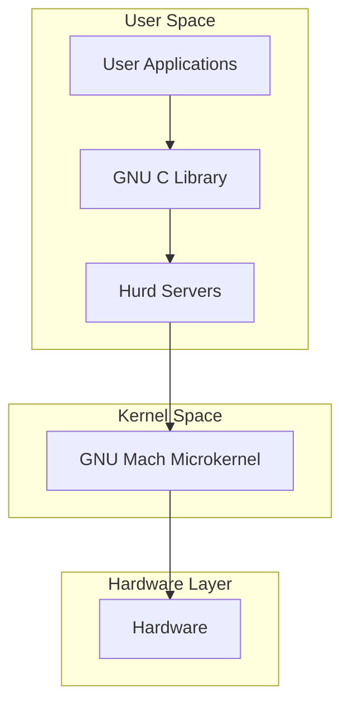
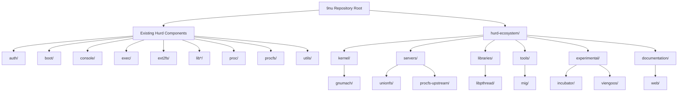
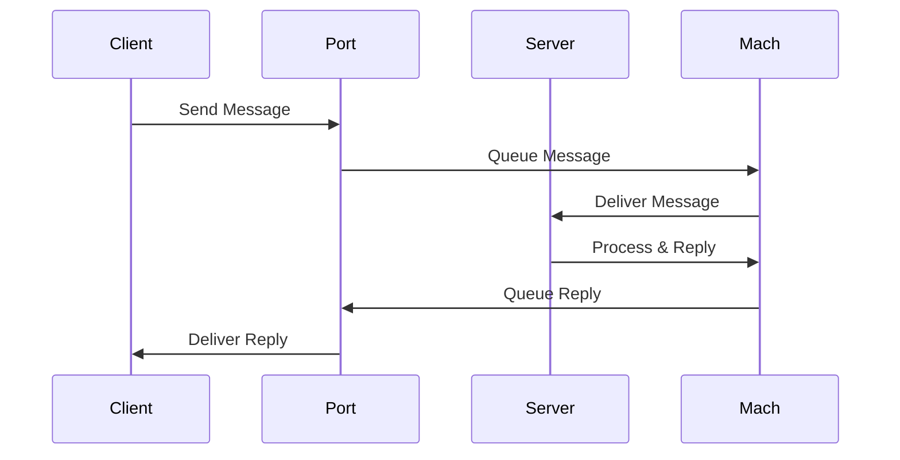
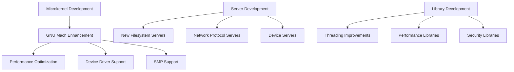
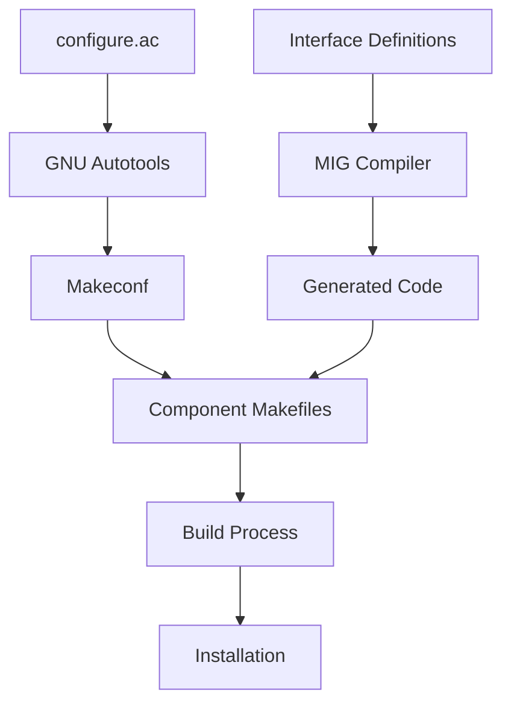
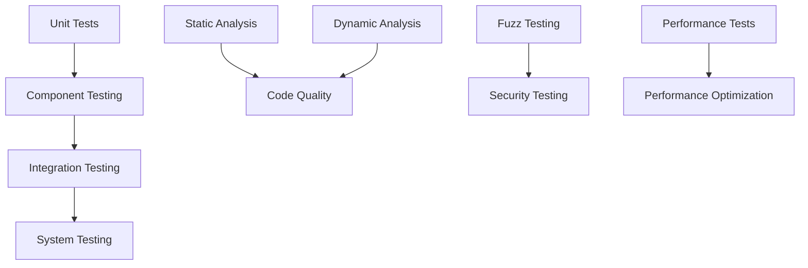
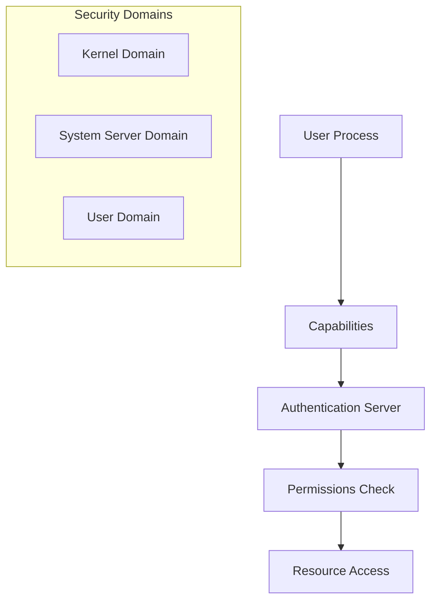

# GNU Hurd Ecosystem Architecture

## Overview
This document provides a comprehensive architectural overview of the GNU Hurd ecosystem as integrated into the 9nu monorepo. The Hurd is a collection of servers running on top of the GNU Mach microkernel, providing a fully free Unix-like operating system.

## System Architecture

### High-Level System Overview


### Detailed Component Architecture

```mermaid
graph TB
    subgraph "Applications Layer"
        APP1[Shell/bash]
        APP2[Text Editors]
        APP3[Compilers]
        APP4[User Programs]
    end
    
    subgraph "C Library & Threading"
        GLIBC[GNU C Library]
        PTHREAD[libpthread]
    end
    
    subgraph "Core Hurd Servers"
        AUTH[auth - Authentication]
        PROC[proc - Process Management]
        EXEC[exec - Program Execution]
        INIT[init - System Initialization]
    end
    
    subgraph "Filesystem Servers"
        EXT2[ext2fs - Ext2 Filesystem]
        UNION[unionfs - Union Filesystem]
        PROCFS[procfs - Process Filesystem]
        ISO[isofs - ISO9660 Filesystem]
        FAT[fatfs - FAT Filesystem]
        NFS[nfs - Network Filesystem]
    end
    
    subgraph "Network Servers"
        PFINET[pfinet - Internet Protocol]
        PFLOCAL[pflocal - Local Sockets]
    end
    
    subgraph "Device & System Servers"
        CONSOLE[console - Console]
        TERM[term - Terminal]
        STOREIO[storeio - Storage I/O]
        HOSTMUX[hostmux - Host Multiplexer]
    end
    
    subgraph "Development Tools"
        MIG[MIG - Interface Generator]
        UTILS[Hurd Utilities]
    end
    
    subgraph "GNU Mach Microkernel"
        IPC[Inter-Process Communication]
        VMEM[Virtual Memory]
        SCHED[Scheduler]
        DEVICES[Device Management]
    end
    
    subgraph "Hardware"
        CPU[Processor]
        MEMORY[Memory]
        DISK[Storage]
        NETWORK[Network Interface]
    end
    
    APP1 --> GLIBC
    APP2 --> GLIBC
    APP3 --> GLIBC
    APP4 --> GLIBC
    
    GLIBC --> PTHREAD
    GLIBC --> AUTH
    GLIBC --> PROC
    GLIBC --> EXT2
    GLIBC --> PFINET
    
    AUTH --> IPC
    PROC --> IPC
    EXEC --> IPC
    EXT2 --> IPC
    UNION --> IPC
    PROCFS --> IPC
    PFINET --> IPC
    PFLOCAL --> IPC
    CONSOLE --> IPC
    
    IPC --> CPU
    VMEM --> MEMORY
    DEVICES --> DISK
    DEVICES --> NETWORK
```


## Monorepo Structure

### Directory Organization


## Inter-Process Communication (IPC) Architecture

### Mach IPC Model


### Interface Generation with MIG
```mermaid
graph LR
    DEF[Interface Definition<br/>(.defs file)] --> MIG[MIG Compiler]
    MIG --> CLIENT[Client Stubs]
    MIG --> SERVER[Server Stubs]
    MIG --> HEADERS[Header Files]
    
    CLIENT --> CAPP[Client Application]
    SERVER --> SAPP[Server Implementation]
    HEADERS --> CAPP
    HEADERS --> SAPP
```

## Development Pathways

### Core System Development


### Build System Integration


### Testing and Quality Assurance


## Development Priorities

### Phase 1: Foundation
1. **Complete Repository Integration**
   - Clone all remaining repositories when network access available
   - Remove .git directories and integrate build systems
   - Resolve any naming conflicts
   - Update documentation cross-references

2. **Build System Unification**
   - Integrate MIG compilation into main build
   - Ensure all components can be built together
   - Create unified configuration system
   - Add dependency management

### Phase 2: Enhancement
1. **Performance Optimization**
   - Profile IPC performance
   - Optimize memory management
   - Improve server startup times
   - Enhance scheduling

2. **Modern Development Practices**
   - Add comprehensive testing framework
   - Implement continuous integration
   - Add static analysis tools
   - Improve debugging support

### Phase 3: Innovation
1. **Research Integration**
   - Evaluate viengoos improvements
   - Integrate successful incubator projects
   - Add modern security features
   - Explore new architectural patterns

2. **Ecosystem Expansion**
   - Add language bindings
   - Create development tools
   - Improve documentation
   - Expand hardware support

## Technology Stack

### Core Technologies
- **Language**: C (primary), some assembly
- **Build System**: GNU Autotools + Make
- **Interface Definition**: MIG interface files
- **Documentation**: Texinfo, Markdown
- **Version Control**: Git (unified in monorepo)

### Key Libraries and Dependencies
- **GNU C Library (glibc)**: System call interface
- **libpthread**: POSIX threading
- **libmachdev**: Device interface abstraction
- **libstore**: Storage abstraction layer
- **libports**: Port management
- **libfshelp**: Filesystem helper functions

## Security Model

### Capability-Based Security


### Privilege Separation
- Each server runs with minimal necessary privileges
- Capabilities provide fine-grained access control
- Authentication server manages user credentials
- Process server manages process relationships

## Performance Characteristics

### IPC Performance
- **Advantage**: Fine-grained modularity
- **Challenge**: Message passing overhead
- **Optimization**: Efficient message queuing and batching

### Memory Management
- **Advantage**: Robust virtual memory system
- **Challenge**: Memory overhead for multiple servers
- **Optimization**: Shared memory regions and copy-on-write

### Scalability
- **Advantage**: Natural parallelism through servers
- **Challenge**: IPC bottlenecks
- **Optimization**: Asynchronous messaging and pipelining

## Future Roadmap

### Short Term (3-6 months)
- Complete monorepo integration
- Stabilize build system
- Improve documentation
- Add basic testing framework

### Medium Term (6-12 months)
- Performance optimization
- Enhanced security features
- Better development tools
- Expanded hardware support

### Long Term (1+ years)
- Research integration from experimental projects
- Modern language bindings
- Formal verification exploration
- Next-generation architecture research

## Conclusion

The GNU Hurd ecosystem represents a unique approach to operating system design, emphasizing modularity, security, and flexibility through its microkernel architecture. This monorepo integration provides a foundation for unified development and enables better coordination between the various components that make up the complete system.

The integration preserves the modular nature of Hurd while providing the benefits of unified version control, build systems, and documentation. This structure supports both traditional Hurd development and experimentation with new approaches through the incubator and viengoos projects.