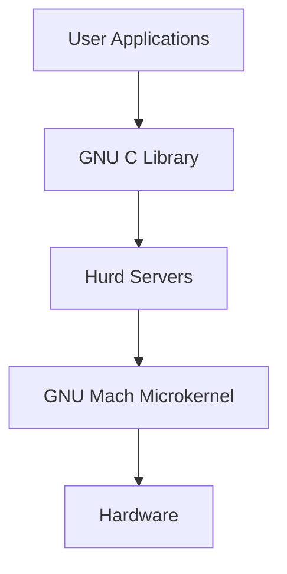

# 9nu - GNU Hurd Ecosystem Monorepo

Welcome to 9nu, a unified monorepo containing the complete GNU Hurd ecosystem. This repository integrates multiple Hurd-related projects into a single, cohesive codebase for easier development and maintenance.

## Repository Structure

### Core Hurd Components (Root Level)
The repository root contains the traditional GNU Hurd components:

- **Servers**: `auth/`, `exec/`, `proc/`, `procfs/`, `console/`, etc.
- **Filesystems**: `ext2fs/`, `fatfs/`, `isofs/`, `nfs/`, `tmpfs/`
- **Libraries**: `lib*/` (libdiskfs, libfshelp, libports, etc.)
- **Utilities**: `utils/`, `sutils/`
- **Network**: `pfinet/`, `pflocal/`
- **Boot System**: `boot/`, `init/`

### Integrated Hurd Ecosystem (`hurd-ecosystem/`)
Additional Hurd components organized by function:

```
hurd-ecosystem/
├── kernel/          # GNU Mach microkernel
├── servers/         # Additional server implementations  
├── libraries/       # Core libraries (libpthread, etc.)
├── tools/           # Development tools (MIG, etc.)
├── experimental/    # Research projects (incubator, viengoos)
└── documentation/   # Project documentation and website
```

## Quick Start

### Prerequisites
- GCC configured for i686-gnu target
- GNU Make
- GNU Autotools
- Git (for development)

### Building
```bash
# Configure the build
./configure --host=i686-gnu

# Build the complete system
make

# Install (requires proper Hurd environment)
make install
```

### Documentation
- **[Architecture Overview](HURD_ARCHITECTURE.md)** - Complete system architecture
- **[Integration Status](hurd-ecosystem/NETWORK_STATUS.md)** - Repository integration status
- **[Original README](README)** - Traditional Hurd documentation
- **[Installation Guide](INSTALL)** - Detailed installation instructions

## Architecture Overview

The GNU Hurd implements a multiserver microkernel architecture:



### Key Components

#### Microkernel (GNU Mach)
- **Location**: `hurd-ecosystem/kernel/gnumach/`
- **Function**: Core system services, IPC, memory management
- **Architecture**: Based on CMU Mach

#### Servers
- **Auth Server**: User authentication and credentials
- **Process Server**: Process management and relationships  
- **Filesystem Servers**: Various filesystem implementations
- **Network Servers**: TCP/IP and local socket support

#### Libraries
- **libpthread**: POSIX threading implementation
- **libdiskfs**: Framework for disk-based filesystems
- **libports**: Port management for IPC
- **libstore**: Storage device abstraction

#### Development Tools
- **MIG**: Mach Interface Generator for IPC code generation
- **Utilities**: System administration and debugging tools

## Development

### Repository Integration Status
Currently, this monorepo contains:
- ✅ **Core Hurd**: Complete traditional Hurd codebase
- ✅ **Directory Structure**: Organized layout for additional components
- ⏳ **External Repositories**: Integration pending network access to git.savannah.gnu.org

### Pending Integration
The following repositories will be integrated when network access is available:
- GNU Mach microkernel (`gnumach`)
- Mach Interface Generator (`mig`)
- POSIX threading library (`libpthread`)
- Union filesystem (`unionfs`)
- Experimental components (`incubator`)
- L4-based Hurd variant (`viengoos`)
- Project documentation (`web`)
- GNU C Library (`glibc`)

### Development Workflow
1. **Code Changes**: Work in component-specific directories
2. **Build System**: Unified build using existing Makeconf system
3. **Testing**: Component and integration testing
4. **Documentation**: Update relevant README files and architecture docs

## Contributing

### Getting Started
1. Read the [Architecture Overview](HURD_ARCHITECTURE.md)
2. Choose a component to work on
3. Follow existing code style and conventions
4. Add tests for new functionality
5. Update documentation as needed

### Key Development Areas
- **Performance**: IPC optimization, memory management
- **Hardware Support**: Device drivers, architecture ports
- **Security**: Capability system enhancements
- **Testing**: Automated testing framework
- **Documentation**: Improved developer guides

## License

The GNU Hurd is free software. All components are covered by the GNU General Public License. See [COPYING](COPYING) for details.

## Resources

- **Project Website**: <http://www.gnu.org/software/hurd/>
- **FAQ**: <http://www.gnu.org/software/hurd/faq.html>
- **Bug Reports**: <bug-hurd@gnu.org>
- **Help**: <help-hurd@gnu.org>
- **IRC**: #hurd on libera.chat

## Historical Context

This repository represents the evolution of the GNU Hurd project into a modern, unified development environment. The original modular approach has been preserved while adding the benefits of monorepo development:

- **Unified Versioning**: All components evolve together
- **Cross-Component Changes**: Easier to maintain consistency
- **Simplified Build**: Single build system for everything
- **Better Testing**: Integration testing across components
- **Comprehensive Documentation**: Complete system view

The integration maintains full compatibility with existing Hurd development practices while enabling new possibilities for collaboration and innovation.

---

*For the original GNU Hurd README, see [README](README).*