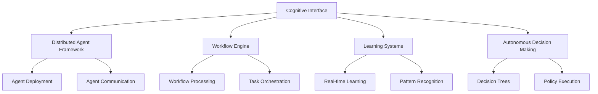

# Cognitive Interface

## Overview

The cognitive interface provides the primary API and integration layer for all cognitive operations within the SKZ framework. It coordinates between the distributed agent framework, workflow engine, learning systems, and autonomous decision making components.

## Architecture



## Components

### 1. Distributed Agent Framework
- **Location**: `distributed-agent-framework.scm`
- **Purpose**: Manages distributed cognitive agents across the system
- **Features**: Agent deployment, monitoring, communication, load balancing

### 2. Workflow Engine
- **Location**: `workflow-engine/processor.scm`
- **Purpose**: Orchestrates complex cognitive workflows
- **Features**: Dependency resolution, parallel processing, fault tolerance

### 3. Learning Systems
- **Location**: `learning-systems/realtime.scm`
- **Purpose**: Implements real-time learning and adaptation
- **Features**: Pattern recognition, statistical learning, reinforcement learning

### 4. Autonomous Decision Making
- **Location**: `autonomous-decisions.scm`
- **Purpose**: Enables autonomous system decision making
- **Features**: Decision trees, policy execution, adaptive behavior

## Integration with SKZ Framework

The cognitive interface integrates seamlessly with:

- **OpenCog AtomSpace**: For knowledge representation
- **GNU/Hurd Microkernel**: For system-level operations
- **Kokkos Parallel Computing**: For high-performance processing
- **GUIX Build System**: For reproducible builds
- **Plan9/Inferno**: For distributed operations

## Usage Examples

### Basic Agent Deployment
```scheme
(use-modules (cognitive-interface distributed-agent-framework))

;; Deploy a cognitive agent
(define my-agent
  (deploy-agent "cognitive-processor"
                '((type . "learning")
                  (priority . "high")
                  (resources . ((cpu . 2) (memory . "1GB"))))))

;; Monitor agent status
(agent-status my-agent)
```

### Workflow Execution
```scheme
(use-modules (cognitive-interface workflow-engine processor))

;; Create a cognitive workflow
(define learning-workflow
  (create-workflow
    '((step1 . "data-preprocessing")
      (step2 . "pattern-recognition")
      (step3 . "model-update"))))

;; Execute workflow
(execute-workflow learning-workflow)
```

### Real-time Learning
```scheme
(use-modules (cognitive-interface learning-systems realtime))

;; Initialize learning system
(define learner (create-realtime-learner
                  '((algorithm . "q-learning")
                    (learning-rate . 0.1)
                    (exploration . 0.3))))

;; Process learning data
(learn learner data-stream)
```

## Configuration

### System Configuration
```scheme
;; cognitive-interface-config.scm
(cognitive-interface-config
  '((max-agents . 100)
    (workflow-timeout . 300)
    (learning-buffer-size . 10000)
    (decision-threshold . 0.8)))
```

### Performance Tuning
- **Agent Pool Size**: Configure based on available resources
- **Workflow Parallelism**: Adjust for optimal CPU utilization
- **Learning Buffer**: Size according to memory constraints
- **Decision Latency**: Balance accuracy vs. response time

## Monitoring and Metrics

### Key Metrics
- Agent deployment success rate
- Workflow execution time
- Learning convergence rate
- Decision accuracy
- System resource utilization

### Health Checks
- Agent health monitoring
- Workflow status tracking
- Learning system performance
- Decision system reliability

## Error Handling

The cognitive interface implements comprehensive error handling:

- **Agent Failures**: Automatic restart and recovery
- **Workflow Errors**: Rollback and retry mechanisms
- **Learning Failures**: Graceful degradation
- **Decision Errors**: Fallback to conservative policies

## Development

### Adding New Components
1. Implement component in appropriate subdirectory
2. Add integration tests
3. Update documentation
4. Register with cognitive interface

### Testing
```bash
# Run cognitive interface tests
cd cogkernel
python3 test-realtime-learning-integration.py
```

## Future Enhancements

- Advanced neural network integration
- Distributed learning algorithms
- Enhanced autonomous capabilities
- Real-time adaptation mechanisms
- Multi-modal cognitive processing

## Contributing

See the main project [contributing guidelines](../../CONTRIBUTING.md) for information on contributing to the cognitive interface.