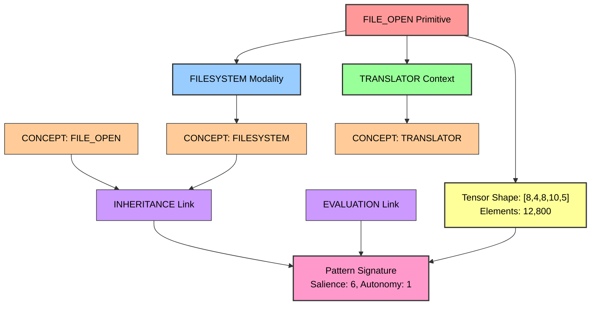

# Hypergraph Flowchart: FILE_OPEN

## Cognitive Fragment Visualization

This diagram shows the hypergraph representation of the FILE_OPEN primitive in the OpenCog-GNUHurd cognitive kernel integration.

### Components:
- **Primitive Node**: The core GNUMach primitive
- **Modality Node**: Operational domain classification
- **Context Node**: Execution environment
- **Atom Nodes**: Individual AtomSpace concepts
- **Link Nodes**: Hypergraph relationships
- **Tensor Node**: Mathematical encoding information
- **Pattern Node**: Unique signature and statistics

Generated: 1754191179
