# GNU Hurd Architecture Overview

This document provides a comprehensive architectural analysis of the GNU Hurd system and its component repositories.

## System Architecture

The GNU Hurd is a multiserver operating system built on top of the GNU Mach microkernel. The architecture follows a design where traditionally kernel-level services are implemented as user-space servers that communicate via inter-process communication (IPC).

### High-Level Architecture

### Component Dependency Graph

```mermaid
graph LR
    subgraph "Core Infrastructure"
        GM[GNU Mach] 
        MIG[MIG - Interface Generator]
    end
    
    subgraph "System Libraries"
        GL[glibc] --> GM
        LP[libpthread] --> GM
        LP --> GL
        MIG --> GL
        MIG --> GM
    end
    
    subgraph "Hurd Servers"
        HS[Hurd Servers] --> GL
        HS --> LP
        HS --> GM
    end
    
    subgraph "File Systems"
        PFS[ProcFS] --> HS
        UFS[UnionFS] --> HS
    end
    
    subgraph "User Interface"
        BASH[GNU Bash] --> GL
        BASH --> HS
    end
    
    subgraph "Future Development"
        INC[Incubator] --> HS
        VG[Viengoos] -.-> GM
        WEB[Web Documentation]
    end
    
    style GM fill:#ff9999
    style GL fill:#99ccff
    style HS fill:#ffcc99
    style VG fill:#cccccc,stroke-dasharray: 5 5
```

### IPC Communication Flow

## Repository Organization

### Core Components

1. **GNU Mach** (`external/hurd-repos/gnumach/`)
   - Microkernel foundation
   - Process and thread management
   - Virtual memory management
   - IPC mechanisms

2. **Hurd Servers** (`external/hurd-repos/hurd/`)
   - Main system servers collection
   - Translator framework
   - Core system services

3. **glibc** (`external/hurd-repos/glibc/`)
   - System call interface
   - POSIX API implementation
   - Hurd-specific adaptations

4. **MIG** (`external/hurd-repos/mig/`)
   - Interface definition compiler
   - RPC stub generator
   - Type safety enforcement

### Supporting Components

5. **libpthread** (`external/hurd-repos/libpthread/`)
   - POSIX threading support
   - Thread synchronization
   - Multi-threading framework

6. **ProcFS** (`external/hurd-repos/procfs/`)
   - Process information interface
   - System monitoring support
   - Linux compatibility

7. **UnionFS** (`external/hurd-repos/unionfs/`)
   - Filesystem layering
   - Package management support
   - Live system development

### Development Tools

8. **GNU Bash** (`external/gnu-repos/bash/`)
   - User shell interface
   - Command execution
   - System administration

9. **Incubator** (`external/hurd-repos/incubator/`)
   - Experimental features
   - Next-generation components
   - Research and development

### Documentation and Community

10. **Web** (`external/hurd-repos/web/`)
    - Project documentation
    - Community resources
    - Developer guides

### Future Development

11. **Viengoos** (`external/hurd-repos/viengoos/`)
    - Next-generation microkernel
    - Improved performance design
    - Capability-based security

## Data Flow Architecture

## Development Pathways

### Current Development Focus

1. **Stability and Performance**
   - Core server optimization
   - Memory management improvements
   - IPC performance enhancements

2. **Hardware Support**
   - Modern device drivers
   - 64-bit architecture support
   - Multi-core support

3. **POSIX Compliance**
   - Enhanced glibc functionality
   - Threading improvements
   - Signal handling

### Near-term Development (1-2 years)

1. **Translator Ecosystem**
   - Enhanced file system support
   - Network protocol improvements
   - Device abstraction layers

2. **Development Tools**
   - Improved debugging support
   - Better development environment
   - Enhanced build system

3. **User Experience**
   - Package management integration
   - System administration tools
   - Performance monitoring

### Long-term Development (3-5 years)

1. **Next-Generation Kernel**
   - Viengoos integration
   - Capability-based security
   - Advanced resource management

2. **Modern Features**
   - Container support
   - Advanced networking
   - GPU acceleration support

3. **Ecosystem Growth**
   - Application porting
   - Distribution development
   - Community expansion

### Research and Innovation

1. **Incubator Projects**
   - Experimental translators
   - New IPC mechanisms
   - Performance prototypes

2. **Academic Collaboration**
   - Research partnerships
   - Thesis projects
   - Conference presentations

3. **Industry Integration**
   - Embedded system support
   - Real-time capabilities
   - Security enhancements

## Build and Development Workflow

## Conclusion

The GNU Hurd represents a unique approach to operating system design through its multiserver architecture. The consolidation of these repositories provides a comprehensive view of the entire system ecosystem, from the microkernel foundation through user-space servers to development tools and future research directions.

The modular design allows for incremental development and experimentation while maintaining system stability. The clear separation of concerns between components enables focused development efforts and promotes code reusability across the ecosystem.