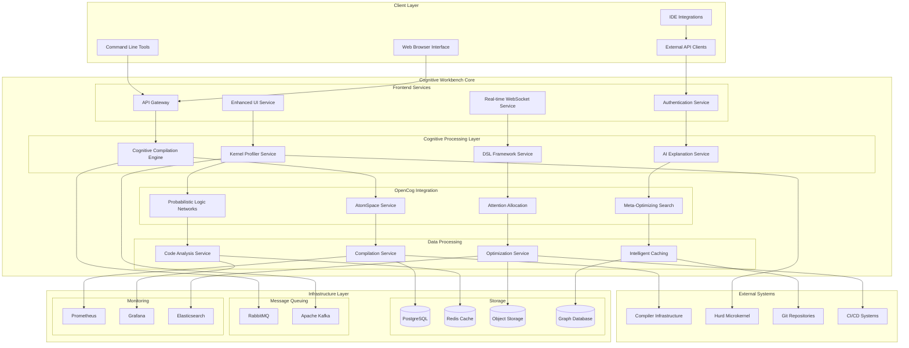

# Cognitive Workbench Technical Architecture Specification

**Project:** HurdCog Compiler Explorer Integration  
**Document Type:** Technical Architecture Specification  
**Version:** 1.0  
**Date:** August 3, 2025

## Overview

This document specifies the technical architecture for the **HurdCog Cognitive Workbench** - a revolutionary integration of Compiler Explorer's compilation infrastructure with OpenCog's cognitive framework, specifically designed for profiling experimental kernel dynamics and developing novel domain-specific languages within the GNU Hurd microkernel ecosystem.

## System Architecture

### High-Level Architecture



### Component Specifications

#### 1. Cognitive Compilation Engine (CCE)

**Purpose:** Core compilation service enhanced with cognitive reasoning capabilities

**Technology Stack:**
- **Runtime:** Node.js 20+ with TypeScript
- **Framework:** Express.js with custom middleware
- **AI Integration:** OpenCog AtomSpace bindings
- **Compilation:** Docker-based compiler execution

**Key Responsibilities:**
- Receive compilation requests with cognitive context
- Apply learned optimization patterns from AtomSpace
- Execute compilation with real-time cognitive feedback
- Store compilation results and patterns for future learning

**API Endpoints:**
```typescript
POST /compile
{
  code: string;
  language: string;
  compiler: string;
  options: CompilerOptions;
  cognitiveContext?: CognitiveContext;
  learningMode?: boolean;
}

GET /compilation/{id}/cognitive-analysis
{
  patterns: Pattern[];
  optimizations: Optimization[];
  suggestions: Suggestion[];
  confidence: number;
}

POST /cognitive-feedback
{
  compilationId: string;
  feedback: UserFeedback;
  effectiveness: number;
}
```

**Cognitive Integration Points:**
- **Pattern Recognition:** Identify recurring compilation patterns
- **Optimization Learning:** Learn effective optimization combinations
- **Context Awareness:** Understand project-specific requirements
- **Predictive Optimization:** Suggest optimizations before compilation

#### 2. Experimental Kernel Profiler

**Purpose:** Real-time profiling and analysis of microkernel behavior with cognitive insights

**Technology Stack:**
- **Runtime:** Python 3.11+ with asyncio
- **Framework:** FastAPI for API services
- **Profiling:** Custom Hurd instrumentation + eBPF
- **Analytics:** Pandas, NumPy, SciPy for data processing

**Key Responsibilities:**
- Real-time monitoring of Hurd microkernel components
- Cognitive analysis of IPC patterns and performance bottlenecks
- Predictive modeling of system behavior under different loads
- Automated detection and explanation of performance anomalies

**Profiling Capabilities:**
```python
class KernelProfiler:
    async def start_profiling(self, components: List[str], 
                            duration: int = 0) -> ProfilingSession
    
    async def analyze_ipc_patterns(self, session_id: str) -> IPCAnalysis
    
    async def predict_performance(self, workload: WorkloadSpec) -> PerformancePrediction
    
    async def identify_bottlenecks(self, session_id: str) -> List[Bottleneck]
    
    async def generate_optimization_suggestions(self, 
                                              analysis: IPCAnalysis) -> List[OptimizationSuggestion]
```

**Cognitive Features:**
- **Behavior Learning:** Learn normal vs. anomalous kernel behavior patterns
- **Predictive Analysis:** Predict system performance under hypothetical conditions
- **Optimization Recommendations:** Suggest kernel configuration optimizations
- **Anomaly Detection:** Identify unusual patterns that may indicate issues

#### 3. Domain-Specific Language Framework

**Purpose:** Framework for creating and managing microkernel-specific domain languages

**Technology Stack:**
- **Parser Generation:** ANTLR4 for grammar definition and parsing
- **Runtime:** JVM-based with Kotlin for DSL implementation
- **Integration:** RESTful APIs for language service integration
- **Validation:** Custom semantic analysis engines

**DSL Development Workflow:**
```kotlin
class DSLFramework {
    fun createDSL(name: String, domain: KernelDomain): DSLDefinition
    
    fun generateGrammar(usage_patterns: List<UsagePattern>): Grammar
    
    fun validateSemantics(code: String, dsl: DSLDefinition): ValidationResult
    
    fun generateCode(dslCode: String, target: CompilationTarget): GeneratedCode
    
    fun analyzeUsage(dsl: DSLDefinition): UsageAnalysis
}
```

**Supported DSL Domains:**
- **IPC Specification Language:** Define inter-process communication patterns
- **Resource Management Language:** Specify resource allocation and lifecycle
- **Security Policy Language:** Define capability-based security policies
- **Performance Configuration Language:** Specify optimization parameters

**Cognitive Enhancement:**
- **Automatic Grammar Inference:** Generate DSL grammars from usage patterns
- **Semantic Validation:** AI-powered verification of DSL code correctness
- **Usage Pattern Analysis:** Learn how DSLs are used and suggest improvements
- **Cross-DSL Integration:** Intelligent integration between different domain languages

#### 4. AtomSpace Service

**Purpose:** Central knowledge repository for cognitive reasoning and learning

**Technology Stack:**
- **Core:** OpenCog AtomSpace with C++ backend
- **API:** Python bindings with FastAPI wrapper
- **Persistence:** PostgreSQL with custom schema
- **Query:** Atomese query language with REST API

**Knowledge Representation:**
```scheme
;; Microkernel Component Atoms
(ConceptNode "hurd-server:ext2fs")
(ConceptNode "hurd-server:proc")
(ConceptNode "hurd-translator:symlink")

;; Compilation Pattern Atoms
(PredicateNode "optimization-effective")
(ListLink
  (ConceptNode "compiler:gcc")
  (ConceptNode "flag:-O3")
  (ConceptNode "component:ext2fs")
  (NumberNode 0.85)) ;; effectiveness score

;; Performance Relationship Atoms
(EvaluationLink
  (PredicateNode "causes-bottleneck")
  (ListLink
    (ConceptNode "ipc-pattern:synchronous-heavy")
    (ConceptNode "performance-issue:high-latency")))
```

**Cognitive Capabilities:**
- **Pattern Learning:** Store and retrieve compilation and optimization patterns
- **Relationship Inference:** Infer relationships between components and behaviors
- **Knowledge Evolution:** Continuously update knowledge based on new experiences
- **Cross-Project Learning:** Transfer knowledge between different microkernel projects

#### 5. AI Explanation Service

**Purpose:** Generate human-readable explanations of cognitive decisions and system behavior

**Technology Stack:**
- **AI Models:** Integration with Claude, GPT, and custom models
- **Framework:** FastAPI with async processing
- **Caching:** Redis for explanation caching
- **Templates:** Jinja2 for explanation formatting

**Explanation Types:**
```python
class ExplanationService:
    async def explain_compilation_decision(self, 
                                         decision: CompilationDecision) -> Explanation
    
    async def explain_optimization_choice(self, 
                                        optimization: Optimization) -> Explanation
    
    async def explain_performance_bottleneck(self, 
                                           bottleneck: Bottleneck) -> Explanation
    
    async def explain_dsl_error(self, 
                               error: DSLError) -> Explanation
    
    async def generate_tutorial_content(self, 
                                      topic: Topic, 
                                      skill_level: SkillLevel) -> Tutorial
```

## Data Models

### Core Entities

#### Compilation Request
```typescript
interface CompilationRequest {
  id: string;
  timestamp: Date;
  userId: string;
  projectId: string;
  
  // Source Code
  code: string;
  language: string;
  compiler: string;
  compilerVersion: string;
  flags: string[];
  
  // Cognitive Context
  cognitiveContext?: {
    previousCompilations: string[];
    learningObjectives: string[];
    optimizationGoals: string[];
    performanceConstraints: PerformanceConstraint[];
  };
  
  // Results
  status: 'pending' | 'compiling' | 'completed' | 'failed';
  assembly?: string;
  errors?: CompilerError[];
  warnings?: CompilerWarning[];
  
  // Cognitive Analysis
  cognitiveAnalysis?: {
    patternsDetected: Pattern[];
    optimizationsApplied: Optimization[];
    suggestions: Suggestion[];
    confidence: number;
    learningValue: number;
  };
}
```

#### Kernel Profiling Session
```typescript
interface ProfilingSession {
  id: string;
  startTime: Date;
  endTime?: Date;
  duration: number;
  
  // Configuration
  components: string[];
  profilingType: 'ipc' | 'performance' | 'resource' | 'security';
  samplingRate: number;
  
  // Data
  events: KernelEvent[];
  metrics: PerformanceMetric[];
  ipcTraces: IPCTrace[];
  
  // Analysis
  analysis?: {
    bottlenecks: Bottleneck[];
    patterns: BehaviorPattern[];
    anomalies: Anomaly[];
    recommendations: Recommendation[];
  };
  
  // Cognitive Insights
  cognitiveInsights?: {
    learnedPatterns: LearnedPattern[];
    predictiveModels: PredictiveModel[];
    optimizationOpportunities: OptimizationOpportunity[];
  };
}
```

#### DSL Definition
```typescript
interface DSLDefinition {
  id: string;
  name: string;
  domain: 'ipc' | 'resource' | 'security' | 'performance';
  version: string;
  
  // Grammar Definition
  grammar: Grammar;
  semanticRules: SemanticRule[];
  codeGenerators: CodeGenerator[];
  
  // Usage Analytics
  usageStats: {
    totalUsages: number;
    errorRate: number;
    popularPatterns: UsagePattern[];
    userFeedback: UserFeedback[];
  };
  
  // Cognitive Enhancement
  cognitiveFeatures: {
    autoCompletion: boolean;
    semanticValidation: boolean;
    optimizationSuggestions: boolean;
    crossDSLIntegration: boolean;
  };
}
```

### Knowledge Graph Schema

#### AtomSpace Schema
```sql
-- Core Atoms Table
CREATE TABLE atoms (
    id SERIAL PRIMARY KEY,
    type VARCHAR(50) NOT NULL,
    name VARCHAR(255),
    truth_value_strength REAL DEFAULT 1.0,
    truth_value_confidence REAL DEFAULT 1.0,
    attention_value_sti INTEGER DEFAULT 0,
    attention_value_lti INTEGER DEFAULT 0,
    created_at TIMESTAMP DEFAULT NOW(),
    updated_at TIMESTAMP DEFAULT NOW()
);

-- Atom Relationships
CREATE TABLE atom_links (
    id SERIAL PRIMARY KEY,
    link_type VARCHAR(50) NOT NULL,
    outgoing_atoms INTEGER[] NOT NULL,
    created_at TIMESTAMP DEFAULT NOW()
);

-- Cognitive Patterns
CREATE TABLE cognitive_patterns (
    id SERIAL PRIMARY KEY,
    pattern_type VARCHAR(50) NOT NULL,
    pattern_data JSONB NOT NULL,
    frequency INTEGER DEFAULT 1,
    effectiveness REAL DEFAULT 0.0,
    last_used TIMESTAMP DEFAULT NOW()
);

-- Learning History
CREATE TABLE learning_events (
    id SERIAL PRIMARY KEY,
    event_type VARCHAR(50) NOT NULL,
    input_atoms INTEGER[],
    output_atoms INTEGER[],
    feedback_score REAL,
    timestamp TIMESTAMP DEFAULT NOW()
);
```

## API Specifications

### RESTful API Design

#### Authentication
```http
POST /auth/login
Content-Type: application/json

{
  "username": "developer@hurdcog.org",
  "password": "secure_password",
  "mfa_token": "123456"
}

Response:
{
  "access_token": "jwt_token_here",
  "refresh_token": "refresh_token_here",
  "expires_in": 3600,
  "user_profile": {
    "id": "user_123",
    "role": "developer",
    "permissions": ["compile", "profile", "dsl_create"]
  }
}
```

#### Cognitive Compilation
```http
POST /cognitive/compile
Authorization: Bearer jwt_token_here
Content-Type: application/json

{
  "code": "#include <hurd.h>\nint main() { return 0; }",
  "language": "c",
  "compiler": "gcc",
  "version": "11.2.0",
  "flags": ["-O2", "-Wall"],
  "cognitive_context": {
    "project_id": "hurd_server_ext2fs",
    "optimization_goals": ["performance", "memory_efficiency"],
    "learning_mode": true
  }
}

Response:
{
  "compilation_id": "comp_456",
  "status": "completed",
  "assembly": "... assembly code ...",
  "cognitive_analysis": {
    "patterns_detected": [
      {
        "type": "memory_allocation_pattern",
        "confidence": 0.92,
        "description": "Standard Hurd memory allocation pattern detected"
      }
    ],
    "optimizations_applied": [
      {
        "type": "loop_unrolling",
        "location": "line 42",
        "impact": "15% performance improvement estimated"
      }
    ],
    "suggestions": [
      {
        "type": "refactoring",
        "description": "Consider using Hurd-specific memory pools for better performance",
        "confidence": 0.78
      }
    ]
  }
}
```

#### Kernel Profiling
```http
POST /profiling/start
Authorization: Bearer jwt_token_here
Content-Type: application/json

{
  "components": ["ext2fs", "proc", "pfinet"],
  "duration": 300,
  "profiling_type": "ipc",
  "cognitive_analysis": true
}

Response:
{
  "session_id": "prof_789",
  "status": "started",
  "estimated_completion": "2025-08-03T15:30:00Z",
  "real_time_endpoint": "ws://localhost:8080/profiling/prof_789/stream"
}

GET /profiling/prof_789/analysis
Authorization: Bearer jwt_token_here

Response:
{
  "session_id": "prof_789",
  "analysis": {
    "ipc_patterns": [
      {
        "pattern": "high_frequency_synchronous_calls",
        "frequency": 1500,
        "components": ["ext2fs", "proc"],
        "impact": "potential_bottleneck"
      }
    ],
    "cognitive_insights": [
      {
        "insight": "IPC pattern suggests need for batching optimization",
        "confidence": 0.87,
        "recommendation": "Implement asynchronous IPC batching for ext2fs-proc communication"
      }
    ]
  }
}
```

#### DSL Management
```http
POST /dsl/create
Authorization: Bearer jwt_token_here
Content-Type: application/json

{
  "name": "HurdIPCSpec",
  "domain": "ipc",
  "description": "Domain-specific language for specifying IPC patterns in Hurd",
  "grammar_source": "grammar HurdIPC; ...",
  "semantic_rules": [...],
  "cognitive_enhancement": {
    "auto_completion": true,
    "semantic_validation": true,
    "optimization_suggestions": true
  }
}

Response:
{
  "dsl_id": "dsl_101",
  "status": "created",
  "validation_result": {
    "grammar_valid": true,
    "semantic_rules_valid": true,
    "cognitive_integration_status": "enabled"
  }
}

POST /dsl/dsl_101/compile
Authorization: Bearer jwt_token_here
Content-Type: application/json

{
  "dsl_code": "ipc_spec { server ext2fs { ... } }",
  "target": "c_code",
  "cognitive_optimization": true
}

Response:
{
  "generated_code": "// Generated C code\n...",
  "cognitive_analysis": {
    "optimizations_applied": [...],
    "potential_issues": [...],
    "suggestions": [...]
  }
}
```

### WebSocket API for Real-time Features

#### Real-time Compilation Feedback
```javascript
// Client-side WebSocket connection
const ws = new WebSocket('ws://localhost:8080/compilation/realtime');

ws.onmessage = (event) => {
  const data = JSON.parse(event.data);
  
  switch(data.type) {
    case 'compilation_progress':
      updateProgress(data.progress);
      break;
      
    case 'cognitive_insight':
      displayInsight(data.insight);
      break;
      
    case 'optimization_suggestion':
      showSuggestion(data.suggestion);
      break;
  }
};

// Send compilation request
ws.send(JSON.stringify({
  type: 'compile',
  data: compilationRequest
}));
```

#### Real-time Profiling Stream
```javascript
const profilingWs = new WebSocket('ws://localhost:8080/profiling/prof_789/stream');

profilingWs.onmessage = (event) => {
  const data = JSON.parse(event.data);
  
  switch(data.type) {
    case 'kernel_event':
      updateKernelVisualization(data.event);
      break;
      
    case 'performance_metric':
      updatePerformanceChart(data.metric);
      break;
      
    case 'cognitive_pattern_detected':
      highlightPattern(data.pattern);
      break;
      
    case 'bottleneck_identified':
      alertBottleneck(data.bottleneck);
      break;
  }
};
```

## Security Architecture

### Authentication and Authorization

#### Multi-Factor Authentication
- **Primary:** Username/password with bcrypt hashing
- **Secondary:** TOTP-based MFA (Google Authenticator compatible)
- **Enterprise:** SAML/LDAP integration for corporate environments

#### Role-Based Access Control (RBAC)
```typescript
enum Role {
  ADMIN = 'admin',
  DEVELOPER = 'developer',
  RESEARCHER = 'researcher',
  STUDENT = 'student',
  GUEST = 'guest'
}

interface Permission {
  resource: string;
  action: 'create' | 'read' | 'update' | 'delete' | 'execute';
}

const rolePermissions: Record<Role, Permission[]> = {
  [Role.ADMIN]: [
    { resource: '*', action: '*' }
  ],
  [Role.DEVELOPER]: [
    { resource: 'compilation', action: 'execute' },
    { resource: 'profiling', action: 'create' },
    { resource: 'dsl', action: 'create' },
    { resource: 'cognitive_features', action: 'read' }
  ],
  [Role.RESEARCHER]: [
    { resource: 'compilation', action: 'read' },
    { resource: 'profiling', action: 'read' },
    { resource: 'analytics', action: 'read' },
    { resource: 'research_api', action: 'execute' }
  ],
  // ... other roles
};
```

### Data Security

#### Encryption
- **Data at Rest:** AES-256 encryption for sensitive data
- **Data in Transit:** TLS 1.3 for all API communications
- **Database:** Transparent data encryption (TDE) for PostgreSQL

#### Code Protection
- **Source Code:** Optional encryption for sensitive source code
- **Compilation Results:** Secure storage with access logging
- **AtomSpace Data:** Encrypted storage of proprietary knowledge

#### Privacy Controls
```typescript
interface PrivacySettings {
  shareCompilationData: boolean;
  sharePerformanceData: boolean;
  shareUsagePatterns: boolean;
  allowCognitiveLearning: boolean;
  dataRetentionPeriod: number; // days
  anonymizeUserData: boolean;
}
```

### Infrastructure Security

#### Container Security
- **Base Images:** Minimal, security-hardened base images
- **Scanning:** Automated vulnerability scanning with Trivy
- **Runtime:** gVisor for additional container isolation
- **Secrets:** Kubernetes secrets with encryption at rest

#### Network Security
- **Segmentation:** Network policies for service isolation
- **API Gateway:** Rate limiting, DDoS protection, WAF
- **VPN:** Required for administrative access
- **Monitoring:** Real-time intrusion detection

## Performance Requirements

### Response Time Requirements

| Operation | Target Response Time | Maximum Acceptable |
|-----------|---------------------|-------------------|
| Code Compilation | < 5 seconds | < 15 seconds |
| Cognitive Analysis | < 2 seconds | < 5 seconds |
| Kernel Profiling Start | < 1 second | < 3 seconds |
| DSL Validation | < 500ms | < 2 seconds |
| Real-time Updates | < 100ms | < 500ms |

### Throughput Requirements

| Service | Target Throughput | Peak Capacity |
|---------|------------------|---------------|
| Compilation Requests | 100 req/sec | 500 req/sec |
| Profiling Sessions | 50 concurrent | 200 concurrent |
| WebSocket Connections | 1000 concurrent | 5000 concurrent |
| API Requests | 10,000 req/sec | 50,000 req/sec |

### Resource Utilization

#### Cognitive Processing
- **CPU:** 70% average utilization across cognitive services
- **Memory:** 80% average utilization with burst capacity
- **Storage:** Intelligent tiering for hot/warm/cold data
- **Network:** <50% bandwidth utilization under normal load

#### Scaling Characteristics
```yaml
# Kubernetes HPA Configuration
apiVersion: autoscaling/v2
kind: HorizontalPodAutoscaler
metadata:
  name: cognitive-compilation-engine
spec:
  scaleTargetRef:
    apiVersion: apps/v1
    kind: Deployment
    name: cognitive-compilation-engine
  minReplicas: 3
  maxReplicas: 20
  metrics:
  - type: Resource
    resource:
      name: cpu
      target:
        type: Utilization
        averageUtilization: 70
  - type: Resource
    resource:
      name: memory
      target:
        type: Utilization
        averageUtilization: 80
  - type: Pods
    pods:
      metric:
        name: compilation_queue_length
      target:
        type: AverageValue
        averageValue: "5"
```

## Deployment Architecture

### Kubernetes-Native Design

#### Service Mesh
- **Technology:** Istio for service-to-service communication
- **Features:** Traffic management, security policies, observability
- **Encryption:** Automatic mTLS between services

#### Microservices Deployment
```yaml
# Cognitive Compilation Engine Deployment
apiVersion: apps/v1
kind: Deployment
metadata:
  name: cognitive-compilation-engine
spec:
  replicas: 3
  selector:
    matchLabels:
      app: cognitive-compilation-engine
  template:
    metadata:
      labels:
        app: cognitive-compilation-engine
    spec:
      containers:
      - name: cce
        image: hurdcog/cognitive-compilation-engine:1.0.0
        ports:
        - containerPort: 8080
        env:
        - name: ATOMSPACE_URL
          value: "http://atomspace-service:8081"
        - name: REDIS_URL
          valueFrom:
            secretKeyRef:
              name: redis-credentials
              key: url
        resources:
          requests:
            memory: "1Gi"
            cpu: "500m"
          limits:
            memory: "4Gi"
            cpu: "2000m"
        livenessProbe:
          httpGet:
            path: /health
            port: 8080
          initialDelaySeconds: 30
          periodSeconds: 10
        readinessProbe:
          httpGet:
            path: /ready
            port: 8080
          initialDelaySeconds: 5
          periodSeconds: 5
```

### Multi-Environment Strategy

#### Development Environment
- **Infrastructure:** Local Kubernetes (kind/minikube)
- **Services:** All services running with development configurations
- **Data:** Sample datasets and synthetic test data
- **Features:** Enhanced debugging, hot reloading, test utilities

#### Staging Environment
- **Infrastructure:** Cloud Kubernetes cluster (reduced capacity)
- **Services:** Production-like configuration with staging data
- **Data:** Anonymized production data subset
- **Features:** Performance testing, integration testing

#### Production Environment
- **Infrastructure:** Multi-region Kubernetes clusters
- **Services:** High availability, auto-scaling configurations
- **Data:** Full production datasets with encryption
- **Features:** Monitoring, alerting, backup and recovery

### CI/CD Pipeline

#### Build Pipeline
```yaml
# GitHub Actions Workflow
name: Build and Deploy
on:
  push:
    branches: [main, develop]
  pull_request:
    branches: [main]

jobs:
  test:
    runs-on: ubuntu-latest
    steps:
    - uses: actions/checkout@v2
    - name: Setup Node.js
      uses: actions/setup-node@v2
      with:
        node-version: '20'
    - name: Install dependencies
      run: npm ci
    - name: Run tests
      run: npm test
    - name: Run cognitive tests
      run: npm run test:cognitive
    
  build:
    needs: test
    runs-on: ubuntu-latest
    steps:
    - uses: actions/checkout@v2
    - name: Build Docker image
      run: docker build -t hurdcog/cce:${{ github.sha }} .
    - name: Push to registry
      run: docker push hurdcog/cce:${{ github.sha }}
    
  deploy:
    needs: build
    runs-on: ubuntu-latest
    if: github.ref == 'refs/heads/main'
    steps:
    - name: Deploy to Kubernetes
      run: |
        kubectl set image deployment/cognitive-compilation-engine \
          cce=hurdcog/cce:${{ github.sha }}
```

## Monitoring and Observability

### Metrics Collection

#### Application Metrics
```typescript
// Prometheus metrics definitions
const compilationDuration = new Histogram({
  name: 'compilation_duration_seconds',
  help: 'Duration of compilation requests',
  labelNames: ['language', 'compiler', 'success']
});

const cognitiveAnalysisAccuracy = new Gauge({
  name: 'cognitive_analysis_accuracy',
  help: 'Accuracy of cognitive analysis predictions',
  labelNames: ['analysis_type', 'component']
});

const atomspaceQueryTime = new Histogram({
  name: 'atomspace_query_duration_seconds',
  help: 'Duration of AtomSpace queries',
  labelNames: ['query_type']
});
```

#### Infrastructure Metrics
- **CPU/Memory/Disk:** Standard system metrics via node-exporter
- **Network:** Service mesh metrics via Istio
- **Kubernetes:** Cluster metrics via kube-state-metrics
- **Database:** PostgreSQL metrics via postgres-exporter

### Logging Strategy

#### Structured Logging
```typescript
// Winston configuration for structured logging
const logger = winston.createLogger({
  format: winston.format.combine(
    winston.format.timestamp(),
    winston.format.errors({ stack: true }),
    winston.format.json()
  ),
  defaultMeta: { 
    service: 'cognitive-compilation-engine',
    version: process.env.APP_VERSION 
  },
  transports: [
    new winston.transports.Console(),
    new winston.transports.Http({
      host: 'elasticsearch',
      port: 9200,
      path: '/logs/_doc'
    })
  ]
});

// Example usage
logger.info('Compilation completed', {
  compilationId: 'comp_123',
  language: 'c',
  compiler: 'gcc',
  duration: 2.5,
  cognitiveInsights: 3,
  userId: 'user_456'
});
```

#### Log Aggregation
- **Collection:** Fluent Bit for log collection and forwarding
- **Storage:** Elasticsearch for log storage and indexing
- **Visualization:** Kibana for log analysis and dashboards
- **Alerting:** ElastAlert for log-based alerting

### Alerting Rules

#### Prometheus Alerting Rules
```yaml
groups:
- name: cognitive-workbench
  rules:
  - alert: HighCompilationFailureRate
    expr: rate(compilation_failures_total[5m]) > 0.1
    for: 2m
    labels:
      severity: warning
    annotations:
      summary: "High compilation failure rate detected"
      description: "Compilation failure rate is {{ $value }} failures per second"
  
  - alert: CognitiveAnalysisAccuracyLow
    expr: cognitive_analysis_accuracy < 0.7
    for: 5m
    labels:
      severity: critical
    annotations:
      summary: "Cognitive analysis accuracy below threshold"
      description: "Accuracy is {{ $value }}, expected > 0.7"
  
  - alert: AtomSpaceResponseSlow
    expr: histogram_quantile(0.95, atomspace_query_duration_seconds) > 2.0
    for: 3m
    labels:
      severity: warning
    annotations:
      summary: "AtomSpace queries are slow"
      description: "95th percentile query time is {{ $value }} seconds"
```

## Conclusion

This technical architecture specification provides a comprehensive blueprint for implementing the HurdCog Cognitive Workbench. The architecture emphasizes:

- **Scalability:** Cloud-native design with auto-scaling capabilities
- **Reliability:** High availability with fault tolerance
- **Security:** Multi-layered security with encryption and access controls
- **Performance:** Optimized for real-time cognitive processing
- **Observability:** Comprehensive monitoring and logging
- **Maintainability:** Microservices architecture with clear service boundaries

The next steps involve detailed implementation planning for each component, beginning with the foundational infrastructure and progressing through the cognitive features in the defined phases.