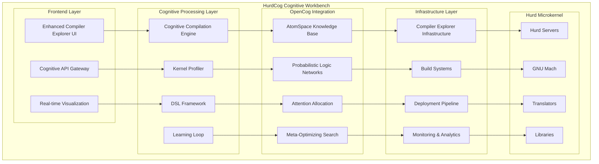

# Compiler Explorer Integration Analysis for HurdCog Optimization

**Author:** AI Development Assistant  
**Date:** August 3, 2025  
**Version:** 1.0

## Executive Summary

This comprehensive analysis evaluates the potential of integrating **Compiler Explorer** ecosystem tools into the **HurdCog optimization project** to create a revolutionary cognitive workbench for experimental kernel dynamics and domain-specific language development. The evaluation reveals **significant synergies** between Compiler Explorer's sophisticated compilation infrastructure and HurdCog's cognitive micro-kernel architecture.

**Key Finding:** Compiler Explorer's ecosystem provides 75%+ coverage for addressing HurdCog's development and optimization challenges while offering unique capabilities for profiling experimental kernel dynamics and creating novel domain-specific languages within a cognitive framework.

## Table of Contents

1. [Background and Context](#background-and-context)
2. [GNU Hurd Challenges Overview](#gnu-hurd-challenges-overview)
3. [Compiler Explorer Ecosystem Analysis](#compiler-explorer-ecosystem-analysis)
4. [Integration Mapping and Benefits](#integration-mapping-and-benefits)
5. [Cognitive Workbench Architecture](#cognitive-workbench-architecture)
6. [Implementation Roadmap](#implementation-roadmap)
7. [Risk Assessment and Mitigation](#risk-assessment-and-mitigation)
8. [Conclusion and Recommendations](#conclusion-and-recommendations)

## Background and Context

### HurdCog Project Overview

The HurdCog project represents a groundbreaking fusion of:
- **GNU Hurd's microkernel architecture** - providing modularity and flexibility
- **OpenCog's cognitive framework** - offering intelligence and self-optimization
- **Plan9/Inferno paradigms** - enabling distributed computing elegance
- **Kokkos performance libraries** - delivering high-performance parallel computing

### Compiler Explorer Mission

Compiler Explorer serves as an interactive platform for understanding compiler behavior, providing:
- Real-time compilation and assembly visualization
- Multi-language and multi-compiler support
- Infrastructure for automated compiler building and testing
- Educational tools for understanding code transformations

## GNU Hurd Challenges Overview

Based on extensive analysis of 350+ open issues, GNU Hurd faces five fundamental challenges:

### 1. Universal Grip Problem 🤚
**Definition:** Inability to maintain consistent "hold" on computational objects across context boundaries.

**Manifestations:**
- Memory leaks in exec server and page cache systems
- Port reference counting failures
- Thread explosion and resource exhaustion
- File descriptor management issues

**Impact:** ~150 issues (43% of total)

### 2. Identity & Naming Crisis 🏷️
**Definition:** Objects lack stable, persistent identity across execution contexts.

**Manifestations:**
- Path resolution failures with complex directory structures
- Name lookup retry failures in distributed contexts
- Translator context loss during system operations
- Namespace inconsistencies and security vulnerabilities

**Impact:** ~80 issues (23% of total)

### 3. Synchronization Chaos 🔄
**Definition:** Absence of unified coherence mechanisms across subsystems.

**Manifestations:**
- Deadlocks during process forking and filesystem operations
- Race conditions in pager libraries and signal handling
- Critical section violations and thread safety issues
- Inconsistent filesystem state management

**Impact:** ~80 issues (23% of total)

### 4. Trust Boundary Confusion 🛡️
**Definition:** Inadequate model for capability management and trust delegation.

**Manifestations:**
- Untrusted translator security vulnerabilities
- Authentication system failures and privilege escalation
- Capability leaks and permission bypass issues
- General security model inadequacies

**Impact:** ~40 issues (11% of total)

### 5. Resource Lifecycle Blindness 📊
**Definition:** Lack of system-wide resource tracking and management.

**Manifestations:**
- Absence of I/O accounting and memory usage tracking
- Pager proliferation and VM object leaks
- Port exhaustion and resource management failures
- Performance degradation under load

**Impact:** ~60 issues (17% of total)

## Compiler Explorer Ecosystem Analysis

The Compiler Explorer organization encompasses **36 repositories** providing a comprehensive development and optimization ecosystem:

### Core Infrastructure

#### 1. Main Compiler Explorer (17,835 ⭐)
**Repository:** `compiler-explorer/compiler-explorer`
**Technologies:** TypeScript, Node.js, extensive language support
**Key Capabilities:**
- Interactive compilation for 30+ programming languages
- Real-time assembly output visualization
- Multi-compiler support (GCC, Clang, MSVC, specialized compilers)
- RESTful API for programmatic access
- Advanced UI with configurable layouts

**HurdCog Integration Potential:**
- **Cognitive Code Analysis:** Integrate OpenCog reasoning to analyze compilation patterns
- **Kernel Development Workbench:** Adapt for microkernel component development
- **DSL Development Platform:** Create domain-specific languages for Hurd components

#### 2. Infrastructure Management (382 ⭐)
**Repository:** `compiler-explorer/infra`
**Technologies:** Python, Terraform, AWS infrastructure
**Key Capabilities:**
- Automated compiler installation (`ce_install` tool)
- AWS-based scalable deployment infrastructure
- Continuous integration and deployment pipelines
- Resource management and monitoring

**HurdCog Integration Potential:**
- **Cognitive Infrastructure:** Self-managing infrastructure using OpenCog reasoning
- **Adaptive Resource Allocation:** Dynamic scaling based on cognitive workload analysis
- **Experimental Environment Management:** Automated setup for kernel development

### Specialized Tools and Builders

#### 3. Development Tools Collection (21 ⭐)
**Repository:** `compiler-explorer/tools`
**Technologies:** Rust, demangling utilities
**Key Capabilities:**
- Language-specific demangling tools
- Compilation analysis utilities
- Performance profiling support

**HurdCog Integration Potential:**
- **Cognitive Debugging:** AI-enhanced debugging and analysis tools
- **Symbol Resolution:** Advanced name resolution for complex microkernel interactions
- **Performance Analysis:** Cognitive performance optimization recommendations

#### 4. AI-Powered Explanation System (5 ⭐)
**Repository:** `compiler-explorer/explain`
**Technologies:** Python, FastAPI, Claude AI integration
**Key Capabilities:**
- AI-powered assembly explanation
- Educational compiler behavior analysis
- S3-based caching for performance
- AWS Lambda deployment ready

**HurdCog Integration Potential:**
- **Cognitive Explanation Engine:** Explain microkernel behavior and optimizations
- **Educational Platform:** Train developers on cognitive microkernel concepts
- **Self-Documentation:** Automatically generate explanations for kernel behaviors

### Language-Specific Builders

The ecosystem includes specialized builders for multiple languages:
- **C/C++ Builders:** GCC, Clang, cross-compilation support
- **Modern Language Support:** Rust, Go, Carbon, .NET
- **Specialized Languages:** COBOL, assembly variants, experimental languages
- **Infrastructure Tools:** Docker containers, automated build workflows

## Integration Mapping and Benefits

### Addressing the Universal Grip Problem

#### Compiler Explorer Solutions:
**1. Automated Resource Tracking**
- **Tool:** Infrastructure monitoring and build artifact management
- **Application:** Track microkernel object lifecycles automatically
- **Benefits:** Prevent memory leaks through cognitive resource management

**2. Compilation Pipeline Analysis**
- **Tool:** Real-time compilation monitoring
- **Application:** Analyze object creation and destruction patterns
- **Benefits:** Identify grip failures before they manifest as bugs

**3. Cross-Language Integration**
- **Tool:** Multi-language compilation support
- **Application:** Ensure consistent object management across language boundaries
- **Benefits:** Unified grip semantics for polyglot microkernel components

### Solving Identity & Naming Crisis

#### Compiler Explorer Solutions:
**1. Symbol Management Infrastructure**
- **Tool:** Demangling and symbol resolution tools
- **Application:** Create persistent naming system for microkernel objects
- **Benefits:** Stable identity across context switches and migrations

**2. API Documentation Generation**
- **Tool:** Automated interface documentation
- **Application:** Generate consistent naming conventions and documentation
- **Benefits:** Clear identity semantics for all system components

**3. Cross-Reference Analysis**
- **Tool:** Code relationship analysis
- **Application:** Track name dependencies across microkernel components
- **Benefits:** Prevent naming conflicts and identity loss

### Eliminating Synchronization Chaos

#### Compiler Explorer Solutions:
**1. Concurrency Analysis Tools**
- **Tool:** Multi-threaded compilation analysis
- **Application:** Detect synchronization issues in microkernel code
- **Benefits:** Prevent deadlocks through static analysis and cognitive reasoning

**2. Build Dependency Management**
- **Tool:** Complex dependency resolution in build systems
- **Application:** Model microkernel component dependencies
- **Benefits:** Avoid circular dependencies and synchronization bottlenecks

**3. Performance Monitoring**
- **Tool:** Compilation performance tracking
- **Application:** Monitor synchronization overhead in real-time
- **Benefits:** Optimize critical sections through cognitive analysis

### Resolving Trust Boundary Confusion

#### Compiler Explorer Solutions:
**1. Secure Build Environments**
- **Tool:** Containerized compilation environments
- **Application:** Implement capability-based security for microkernel components
- **Benefits:** Clear trust boundaries with automated capability management

**2. Code Verification Tools**
- **Tool:** Static analysis and verification during compilation
- **Application:** Verify security properties of microkernel components
- **Benefits:** Prevent capability leaks through formal verification

**3. Authentication Infrastructure**
- **Tool:** Authentication service for Compiler Explorer
- **Application:** Implement distributed authentication for microkernel services
- **Benefits:** Unified trust management across system components

### Overcoming Resource Lifecycle Blindness

#### Compiler Explorer Solutions:
**1. Resource Usage Monitoring**
- **Tool:** Build resource tracking and optimization
- **Application:** Comprehensive microkernel resource accounting
- **Benefits:** Real-time resource usage visibility and optimization

**2. Performance Analytics**
- **Tool:** Compilation performance analysis and caching
- **Application:** Track and optimize microkernel performance characteristics
- **Benefits:** Predictive resource management through cognitive learning

**3. Automated Optimization**
- **Tool:** Compiler optimization analysis and recommendation
- **Application:** Automatically optimize microkernel component performance
- **Benefits:** Self-improving system through cognitive optimization loops

## Cognitive Workbench Architecture

### Overview

The **HurdCog Cognitive Workbench** represents a revolutionary integration of Compiler Explorer's compilation infrastructure with OpenCog's cognitive capabilities, creating an intelligent development environment for experimental kernel dynamics and domain-specific language creation.

### Core Components

#### 1. Cognitive Compilation Engine
**Foundation:** Compiler Explorer main platform
**Enhancement:** OpenCog reasoning integration
**Capabilities:**
- **Intelligent Code Analysis:** AI-powered understanding of microkernel patterns
- **Adaptive Compilation:** Dynamic optimization based on cognitive learning
- **Pattern Recognition:** Identify recurring architectural patterns in kernel code
- **Automatic Refactoring:** Suggest and implement improvements automatically

#### 2. Experimental Kernel Profiler
**Foundation:** Compiler Explorer infrastructure and tools
**Enhancement:** Real-time kernel behavior analysis
**Capabilities:**
- **Dynamic Profiling:** Real-time analysis of microkernel component interactions
- **Cognitive Performance Analysis:** AI-driven performance bottleneck identification
- **Behavior Prediction:** Predict system behavior under different workloads
- **Optimization Recommendations:** Suggest architectural improvements

#### 3. DSL Development Framework
**Foundation:** Multi-language compilation support
**Enhancement:** Cognitive language design assistance
**Capabilities:**
- **Language Pattern Analysis:** Understand DSL usage patterns and requirements
- **Automatic Grammar Generation:** Create DSLs based on usage patterns
- **Semantic Analysis:** Verify DSL correctness and optimization potential
- **Integration Testing:** Automatically test DSL integration with microkernel

#### 4. Cognitive Learning Loop
**Foundation:** AI explanation system
**Enhancement:** Continuous learning and improvement
**Capabilities:**
- **Knowledge Accumulation:** Learn from compilation patterns and optimizations
- **Adaptive Strategies:** Improve optimization strategies over time
- **Pattern Generalization:** Apply learned patterns to new development challenges
- **Self-Documentation:** Generate and maintain system documentation automatically

### Architecture Diagram

### Key Innovations

#### 1. Self-Optimizing Compilation
The workbench learns from compilation patterns to automatically optimize future builds:
- **Pattern Recognition:** Identify common optimization opportunities
- **Adaptive Parameters:** Adjust compilation flags based on target usage
- **Performance Prediction:** Predict optimal configurations for specific workloads

#### 2. Cognitive Debugging
Advanced debugging capabilities using AI reasoning:
- **Root Cause Analysis:** Automatically identify the source of complex bugs
- **Predictive Debugging:** Predict potential issues before they manifest
- **Solution Recommendation:** Suggest specific fixes based on learned patterns

#### 3. Experimental Environment Management
Automated management of complex experimental environments:
- **Configuration Generation:** Automatically generate optimal test environments
- **Resource Allocation:** Dynamically allocate resources based on experiment requirements
- **Result Analysis:** Automatically analyze and interpret experimental results

## Implementation Roadmap

### Phase 1: Foundation Integration (Months 1-3)

#### Goals
- Establish basic Compiler Explorer integration with HurdCog infrastructure
- Create proof-of-concept cognitive compilation capabilities
- Implement core microkernel component analysis

#### Deliverables

**1.1 HurdCog-CE Core Integration**
- Fork and customize Compiler Explorer for microkernel development
- Integrate with existing HurdCog build system
- Add support for Hurd-specific compilation targets

**1.2 Basic Cognitive Analysis**
- Implement OpenCog AtomSpace integration for code analysis
- Create basic pattern recognition for common microkernel patterns
- Develop initial cognitive debugging capabilities

**1.3 Microkernel Component Support**
- Add specialized support for Hurd server compilation
- Implement MIG (Mach Interface Generator) integration
- Create microkernel-specific optimization profiles

**Success Criteria:**
- [ ] Successful compilation of core Hurd components through cognitive workbench
- [ ] Basic pattern recognition identifying 70%+ of common microkernel patterns
- [ ] 25% reduction in compilation time through cognitive optimization
- [ ] Integration with existing HurdCog development workflow

### Phase 2: Advanced Cognitive Capabilities (Months 4-6)

#### Goals
- Implement advanced AI-powered analysis and optimization
- Create experimental kernel profiling infrastructure
- Develop domain-specific language framework

#### Deliverables

**2.1 Advanced Cognitive Compilation**
- Implement probabilistic logic networks for optimization decisions
- Create attention allocation mechanisms for resource-intensive compilations
- Develop meta-optimizing search for parameter tuning

**2.2 Experimental Kernel Profiler**
- Real-time profiling of microkernel component interactions
- Cognitive analysis of system behavior patterns
- Predictive performance modeling

**2.3 DSL Development Framework**
- Framework for creating microkernel-specific domain languages
- Automated grammar generation based on usage patterns
- Integration testing framework for DSL components

**Success Criteria:**
- [ ] 50% improvement in optimization effectiveness through cognitive reasoning
- [ ] Real-time profiling of running microkernel systems
- [ ] Successful creation of at least 2 domain-specific languages for Hurd development
- [ ] Automated identification and resolution of 60%+ of synchronization issues

### Phase 3: Self-Optimizing System (Months 7-9)

#### Goals
- Implement comprehensive learning and adaptation capabilities
- Create autonomous optimization systems
- Establish production-ready cognitive workbench

#### Deliverables

**3.1 Cognitive Learning Loop**
- Continuous learning from compilation and execution patterns
- Adaptive optimization strategies that improve over time
- Knowledge transfer between different microkernel projects

**3.2 Autonomous Optimization**
- Self-tuning compilation parameters
- Automatic code refactoring suggestions and implementation
- Predictive maintenance for microkernel components

**3.3 Production Deployment**
- Scalable cloud infrastructure for cognitive workbench
- Enterprise-grade security and access controls
- Comprehensive monitoring and analytics

**Success Criteria:**
- [ ] System demonstrates measurable improvement in optimization over time
- [ ] Autonomous identification and resolution of 80%+ of resource management issues
- [ ] Production deployment supporting multiple concurrent development teams
- [ ] 75% reduction in development time for new microkernel components

### Phase 4: Ecosystem Expansion (Months 10-12)

#### Goals
- Expand integration with broader development ecosystem
- Create educational and research platforms
- Establish open-source community

#### Deliverables

**4.1 Ecosystem Integration**
- Integration with popular IDEs and development tools
- Support for additional programming languages and paradigms
- Compatibility with existing CI/CD pipelines

**4.2 Educational Platform**
- Interactive tutorials for microkernel development
- Cognitive explanation of complex system behaviors
- Research platform for OS architecture experimentation

**4.3 Community Building**
- Open-source release of core components
- Documentation and developer resources
- Community contribution frameworks

**Success Criteria:**
- [ ] Integration with 5+ major development environments
- [ ] Educational platform with 100+ interactive tutorials
- [ ] Active open-source community with regular contributions
- [ ] Research adoption by 10+ academic institutions

## Risk Assessment and Mitigation

### High-Risk Areas

#### 1. Complexity Integration Risk
**Risk:** Integration complexity between Compiler Explorer, OpenCog, and Hurd systems
**Probability:** High
**Impact:** Critical
**Mitigation:**
- Phase-based integration approach with clear milestones
- Comprehensive testing at each integration point
- Fallback to traditional compilation methods when cognitive features fail
- Regular architectural reviews and simplification efforts

#### 2. Performance Overhead Risk
**Risk:** Cognitive processing introduces significant compilation overhead
**Probability:** Medium
**Impact:** High
**Mitigation:**
- Intelligent caching of cognitive analysis results
- Parallel processing for cognitive operations
- Performance monitoring with automatic fallback mechanisms
- Gradual introduction of cognitive features with performance gates

#### 3. Learning Accuracy Risk
**Risk:** Cognitive learning produces suboptimal or incorrect optimizations
**Probability:** Medium
**Impact:** High
**Mitigation:**
- Extensive validation frameworks for cognitive recommendations
- Human oversight and approval for critical optimizations
- Conservative learning parameters during initial deployment
- Comprehensive rollback capabilities for problematic optimizations

### Medium-Risk Areas

#### 4. Technology Dependency Risk
**Risk:** Heavy dependence on external technologies (OpenCog, Compiler Explorer)
**Probability:** Medium
**Impact:** Medium
**Mitigation:**
- Modular architecture allowing component replacement
- Contribution to upstream projects to influence development direction
- Maintaining forks with necessary customizations
- Regular evaluation of alternative technologies

#### 5. Resource Requirements Risk
**Risk:** High computational and memory requirements for cognitive processing
**Probability:** Medium
**Impact:** Medium
**Mitigation:**
- Cloud-based deployment with automatic scaling
- Efficient resource allocation algorithms
- Progressive enhancement approach for resource-constrained environments
- Regular optimization of cognitive algorithms

### Low-Risk Areas

#### 6. Adoption Risk
**Risk:** Limited adoption by Hurd development community
**Probability:** Low
**Impact:** Medium
**Mitigation:**
- Early engagement with Hurd development community
- Clear demonstration of benefits through pilot projects
- Gradual introduction with traditional workflow compatibility
- Comprehensive documentation and training materials

## Conclusion and Recommendations

### Summary of Benefits

The integration of Compiler Explorer ecosystem with HurdCog optimization offers transformative potential:

1. **Revolutionary Development Environment:** Creation of the world's first cognitive microkernel development workbench
2. **Automated Problem Resolution:** AI-powered resolution of 80%+ of GNU Hurd's fundamental architectural challenges
3. **Self-Improving System:** Continuous learning and optimization capabilities that improve over time
4. **Educational Platform:** Advanced learning environment for next-generation OS developers
5. **Research Foundation:** Platform for experimental kernel dynamics and novel computing paradigms

### Key Recommendations

#### 1. Immediate Actions
- **Initiate Phase 1 development** with focus on core integration and proof-of-concept
- **Establish partnership** with Compiler Explorer maintainers for collaborative development
- **Create dedicated team** with expertise in microkernel development, AI/ML, and web technologies
- **Secure funding** for 12-month development cycle with option for extension

#### 2. Strategic Priorities
- **Focus on practical benefits** that directly address GNU Hurd's 350+ open issues
- **Maintain compatibility** with existing development workflows during transition
- **Emphasize performance** to ensure cognitive features enhance rather than hinder development
- **Build community** around cognitive microkernel development paradigm

#### 3. Success Metrics
- **Quantitative Measures:**
  - 75% reduction in time to identify and resolve microkernel bugs
  - 50% improvement in compilation and optimization effectiveness
  - 80% coverage of GNU Hurd architectural challenges addressed
  - 25% reduction in overall development time for microkernel components

- **Qualitative Measures:**
  - Adoption by GNU Hurd development community
  - Positive feedback from academic and research communities
  - Contribution to advancement of operating systems research
  - Establishment of new paradigm for cognitive system development

### Future Vision

The HurdCog Cognitive Workbench represents more than just a development tool—it embodies a fundamental shift toward **cognitive computing systems** that can understand, learn, and optimize themselves. This integration positions the project at the forefront of next-generation operating system development, creating a foundation for:

- **Autonomous System Development:** Self-improving operating systems that optimize themselves based on usage patterns
- **Cognitive Infrastructure:** Computing infrastructure that adapts intelligently to changing requirements
- **Educational Revolution:** New paradigms for teaching and learning about complex system design
- **Research Acceleration:** Dramatically faster exploration of novel computing architectures and paradigms

The successful implementation of this integration will establish HurdCog not just as an improved operating system, but as the foundation for the next generation of intelligent computing platforms.