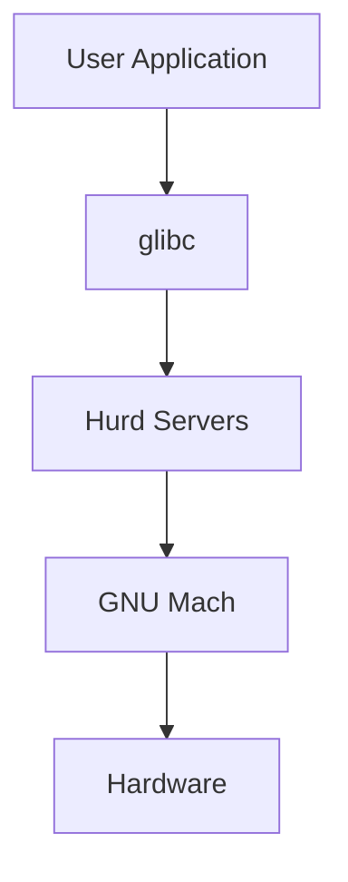

# Documentation Standards and Guidelines

This document establishes standards and guidelines for documentation within the GNU Hurd project and the 9nu consolidated repository.

## Documentation Philosophy

### Core Principles
- **Accuracy**: Documentation must be correct and up-to-date
- **Completeness**: Cover all aspects necessary for understanding
- **Clarity**: Written in clear, understandable language
- **Accessibility**: Available to users of different skill levels
- **Maintainability**: Easy to update and maintain over time

### Target Audiences
- **End Users**: People using Hurd as an operating system
- **Developers**: Contributors writing code for the project
- **System Administrators**: People deploying and managing Hurd systems
- **Researchers**: Academics studying microkernel architectures
- **Students**: People learning about operating systems

## Documentation Structure

### Repository Organization
```
docs/
├── README.md                    # Overview and navigation
├── ARCHITECTURE.md              # System architecture
├── DEVELOPMENT_PATHWAYS.md      # Development guidance
└── open-issues/                 # Open documentation issues
    ├── README.md               # Documentation overview
    ├── advantages.md           # Technical advantages
    ├── capabilities.md         # Security model
    ├── challenges.md           # Current limitations
    ├── community.md           # Community resources
    ├── contributing.md        # Contribution guidelines
    ├── documentation.md       # This file
    ├── faq.md                 # Frequently asked questions
    ├── glibc.md              # C library integration
    ├── hurd.md               # Core system components
    ├── microkernel.md        # Microkernel architecture
    ├── open-issues.md        # Known issues
    └── user.md               # User documentation
```

### File Naming Conventions
- **Lowercase**: All filenames in lowercase
- **Hyphens**: Use hyphens for word separation
- **Descriptive**: Names should clearly indicate content
- **Extensions**: Use `.md` for Markdown files

### Cross-References
- **Relative Links**: Use relative paths for internal links
- **Descriptive Text**: Link text should describe the destination
- **Consistency**: Maintain consistent linking patterns
- **Validation**: Regularly check for broken links

## Content Standards

### Writing Style

#### Language and Tone
- **Clear and Concise**: Avoid unnecessary complexity
- **Professional**: Maintain professional tone throughout
- **Inclusive**: Use inclusive language and examples
- **Consistent**: Maintain consistent terminology and style

#### Technical Writing Guidelines
```markdown
# Use Active Voice
Good: "The server processes the request"
Avoid: "The request is processed by the server"

# Be Specific
Good: "The authentication server validates user credentials"
Avoid: "The system does authentication stuff"

# Use Parallel Structure
Good: "Features include security, performance, and reliability"
Avoid: "Features include security, good performance, and it's reliable"
```

### Document Structure

#### Standard Document Template
```markdown
# Document Title

Brief overview paragraph explaining the document's purpose and scope.

## Overview
General introduction to the topic.

## Core Concepts
Key concepts and terminology.

## Implementation Details
Technical details and implementation specifics.

## Examples
Practical examples and code samples.

## Common Issues
Known problems and solutions.

## Further Reading
Links to related documentation.

---
*Footer note explaining the document's role in addressing open issues.*
```

#### Section Organization
- **Logical Flow**: Information should flow logically from general to specific
- **Hierarchical Structure**: Use proper heading levels (H1, H2, H3, etc.)
- **Consistent Formatting**: Maintain consistent formatting throughout
- **Table of Contents**: For longer documents, include navigation aids

### Code Documentation

#### Code Examples
```c
// Example with proper documentation
/**
 * Create a new capability with specified rights
 * @param object Object identifier for the capability
 * @param rights Access rights to grant
 * @return New capability or error code
 */
capability_t create_capability(object_id_t object, rights_t rights) {
    // Implementation details...
}
```

#### Code Style
- **Syntax Highlighting**: Use appropriate language identifiers
- **Complete Examples**: Provide complete, working examples
- **Comments**: Include explanatory comments in code
- **Error Handling**: Show proper error handling patterns

#### Command Line Examples
```bash
# Good: Show command with explanation
# Install required development packages
sudo apt-get install build-essential mig gnumach-dev

# Configure build environment
./configure --host=i686-gnu --prefix=/usr

# Build the project
make -j$(nproc)
```

### API Documentation

#### Function Documentation
```c
/**
 * @brief Brief description of function purpose
 * @param param1 Description of first parameter
 * @param param2 Description of second parameter
 * @return Description of return value
 * @retval SPECIFIC_VALUE When this specific value is returned
 * @see related_function() for related functionality
 * @since Version when function was introduced
 * @deprecated Use new_function() instead
 */
error_t example_function(int param1, char *param2);
```

#### Interface Documentation
- **Parameter Types**: Clearly specify parameter types and constraints
- **Return Values**: Document all possible return values
- **Error Conditions**: Explain when and why errors occur
- **Thread Safety**: Document thread safety characteristics
- **Side Effects**: Note any side effects or state changes

## Visual Documentation

### Diagrams and Illustrations

#### Architecture Diagrams


#### Flowcharts
- **Process Flow**: Show step-by-step processes
- **Decision Trees**: Illustrate decision-making logic
- **System Interactions**: Show component relationships
- **Data Flow**: Demonstrate data movement through system

#### Formatting Guidelines
- **Consistent Style**: Use consistent visual style across diagrams
- **Clear Labels**: All elements should be clearly labeled
- **Readable Fonts**: Use readable fonts and appropriate sizes
- **Color Usage**: Use color purposefully and accessibly

### Screenshots and Examples
- **Current Screenshots**: Keep screenshots up-to-date
- **Annotated Images**: Add annotations to highlight important features
- **Multiple Formats**: Provide images in web-friendly formats
- **Alt Text**: Include descriptive alt text for accessibility

## Maintenance and Quality

### Review Process

#### Content Review
- **Technical Accuracy**: Verify technical correctness
- **Completeness**: Check for missing information
- **Clarity**: Ensure content is understandable
- **Consistency**: Maintain consistent style and terminology

#### Review Workflow
1. **Author Review**: Self-review before submission
2. **Peer Review**: Review by technical peers
3. **Editorial Review**: Review for style and clarity
4. **Final Approval**: Approval by maintainers

### Update Procedures

#### Regular Maintenance
- **Quarterly Reviews**: Regular review of all documentation
- **Version Updates**: Update for new software versions
- **Link Checking**: Verify external and internal links
- **Accuracy Verification**: Confirm technical accuracy

#### Change Management
```bash
# Documentation change workflow
git checkout -b docs/update-topic
# Make documentation changes
git add docs/
git commit -m "docs: Update topic documentation

- Add new section on feature X
- Fix broken links to external resources
- Update code examples for latest version"
git push origin docs/update-topic
# Create pull request for review
```

### Quality Metrics

#### Measurable Standards
- **Link Validity**: < 1% broken links
- **Update Frequency**: Critical docs updated within 30 days of changes
- **Coverage**: 100% of public APIs documented
- **Accessibility**: WCAG 2.1 AA compliance for web documentation

#### Quality Indicators
- **User Feedback**: Regular user surveys and feedback collection
- **Issue Reports**: Track documentation-related issues
- **Usage Analytics**: Monitor documentation usage patterns
- **Community Contributions**: Encourage community documentation contributions

## Tools and Infrastructure

### Documentation Tools

#### Markdown Processing
- **Markdown Extensions**: Use standard Markdown with minimal extensions
- **Code Highlighting**: Syntax highlighting for code blocks
- **Math Rendering**: LaTeX-style math notation when needed
- **Diagram Support**: Mermaid for simple diagrams

#### Build System Integration
```bash
# Documentation build commands
make docs                    # Build all documentation
make docs-check             # Check for errors and broken links
make docs-install           # Install documentation
make docs-clean             # Clean generated documentation
```

### Version Control

#### Documentation Versioning
- **Tag Releases**: Tag documentation releases with software releases
- **Branch Strategy**: Use feature branches for major documentation updates
- **History Preservation**: Maintain complete change history
- **Release Notes**: Document changes in release notes

#### File Management
- **Binary Files**: Store images and other binary files appropriately
- **Size Limits**: Keep individual files under reasonable size limits
- **Organization**: Maintain clean directory structure
- **Cleanup**: Regular cleanup of obsolete files

## Accessibility and Internationalization

### Accessibility Standards
- **Screen Readers**: Compatible with screen reading software
- **Keyboard Navigation**: Fully navigable with keyboard
- **Color Contrast**: Sufficient color contrast for readability
- **Alt Text**: Descriptive alternative text for images

### Language Considerations
- **Primary Language**: English as primary documentation language
- **Translation Support**: Structure to support future translations
- **Cultural Sensitivity**: Avoid culturally specific references
- **Plain Language**: Use simple, clear language where possible

## Community Involvement

### Contribution Guidelines
- **Open Participation**: Welcome contributions from all community members
- **Attribution**: Proper attribution for all contributors
- **Review Process**: Fair and transparent review process
- **Feedback Mechanisms**: Multiple ways to provide feedback

### Documentation Sprints
- **Organized Events**: Regular documentation improvement events
- **Focus Areas**: Targeted improvement of specific documentation areas
- **New Contributor Onboarding**: Special focus on helping new contributors
- **Recognition**: Recognition for documentation contributions

## Integration with Development

### Code-Documentation Synchronization
- **API Changes**: Automatic alerts for API changes requiring documentation updates
- **Feature Documentation**: Documentation requirements for new features
- **Deprecation Process**: Clear process for documenting deprecated features
- **Release Coordination**: Coordination between code and documentation releases

### Developer Responsibilities
- **Code Comments**: Adequate inline documentation in source code
- **Interface Documentation**: Documentation for all public interfaces
- **Change Documentation**: Documentation of significant changes
- **Review Participation**: Participation in documentation reviews

## Future Directions

### Planned Improvements
- **Interactive Documentation**: Explore interactive documentation formats
- **Video Content**: Consider video tutorials for complex topics
- **Community Wiki**: Community-editable documentation sections
- **Automated Generation**: Automated generation from source code where appropriate

### Technology Evaluation
- **Documentation Platforms**: Evaluate modern documentation platforms
- **Collaboration Tools**: Assess tools for collaborative documentation
- **Accessibility Tools**: Explore accessibility checking and improvement tools
- **Analytics Integration**: Better understanding of documentation usage

## Further Reading

- [Contributing Guidelines](contributing.md)
- [Community Resources](community.md)
- [Open Issues](open-issues.md)
- [GNU Documentation Standards](https://www.gnu.org/prep/standards/)

---

*This document establishes comprehensive standards for documentation within the GNU Hurd project, addressing open documentation issues related to consistency, quality, and maintainability.*