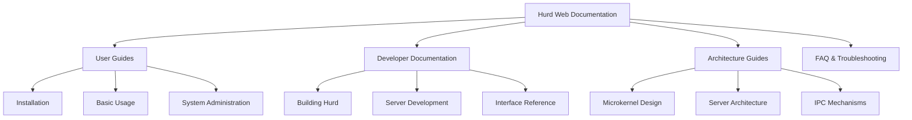

# Hurd Documentation

## Overview
Documentation, website content, and guides for the GNU Hurd project.

## Components

### Web
- **Purpose**: Official Hurd project website and documentation
- **Source**: `https://git.savannah.gnu.org/git/hurd/web.git`
- **Function**: Public-facing documentation and project information
- **Content**: Tutorials, guides, FAQ, development documentation

## Documentation Structure

## Documentation Categories

### User Documentation
- Installation instructions
- System configuration
- Filesystem management
- Network configuration
- Package management

### Developer Documentation
- Build system guide
- Coding standards
- Server development tutorial
- IPC programming guide
- Debugging techniques

### Architecture Documentation
- System overview
- Component relationships
- Design principles
- Performance considerations

## Integration with Repository
The web documentation will provide:
- **Cross-references** to code in this monorepo
- **Build instructions** for the integrated codebase
- **Development guides** using the monorepo structure
- **Architecture diagrams** reflecting the integrated layout

## Local Documentation Files
This repository already contains several documentation files:
- `README` - Basic project information
- `INSTALL` - Installation instructions
- `INSTALL-cross` - Cross-compilation guide
- `NEWS` - Release notes and changes
- `TODO` - Development tasks
- `BUGS` - Known issues
- `ChangeLog` - Change history

## Documentation Integration Plan
1. **Merge web content** with existing docs
2. **Update build instructions** for monorepo
3. **Create unified guide** for the integrated codebase
4. **Generate API documentation** from code
5. **Maintain cross-references** between components

## Integration Status
- [ ] web - **Pending network access**

## Future Enhancements
- Automated documentation generation
- Code example integration
- Interactive tutorials
- Architecture visualization tools