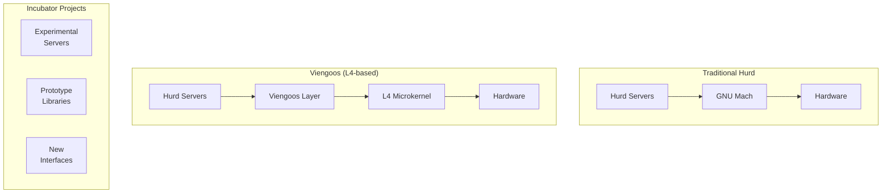
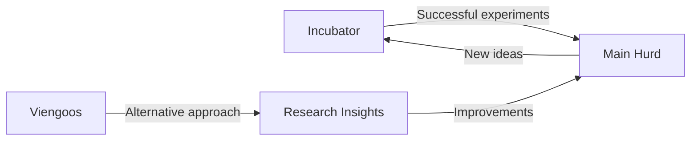

# Experimental Hurd Components

## Overview
This directory contains experimental and alternative implementations within the Hurd ecosystem.

## Components

### Incubator
- **Purpose**: Experimental Hurd components and prototypes
- **Source**: `https://git.savannah.gnu.org/git/hurd/incubator.git`
- **Function**: Testing ground for new ideas and implementations
- **Status**: Experimental, not for production use

### Viengoos
- **Purpose**: L4-based alternative Hurd implementation
- **Source**: `https://git.savannah.gnu.org/git/hurd/viengoos.git`
- **Function**: Hurd personality on L4 microkernel family
- **Status**: Research project, alternative architecture

## Experimental Architecture Comparison

## Research Directions

### Viengoos Project
- **Goal**: Port Hurd to L4 microkernel family
- **Benefits**: 
  - Better performance characteristics
  - Formal verification possibilities
  - Modern microkernel design
- **Challenges**:
  - Mach compatibility layer needed
  - Significant architectural differences

### Incubator Experiments
- **New server implementations**
- **Performance optimizations**
- **Security enhancements**
- **Alternative IPC mechanisms**
- **Modern language bindings**

## Development Guidelines
- **Experimental nature**: Code may be unstable
- **Research focus**: Exploring new possibilities
- **Documentation**: Important for understanding experiments
- **Integration**: May eventually merge into main Hurd

## Relationship to Main Hurd

## Integration Status
- [ ] incubator - **Pending network access**
- [ ] viengoos - **Pending network access**

## Future Possibilities
- Performance improvements from L4 research
- New server architectures from incubator
- Security enhancements
- Modern development practices