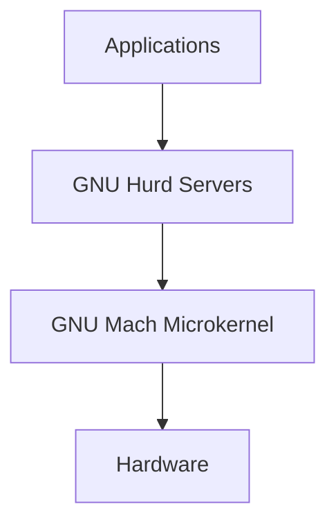

# GNU Mach Microkernel (gnumach)

## Overview
GNU Mach is the microkernel that forms the foundation of the GNU Hurd operating system. It is based on the CMU Mach microkernel.

## Purpose in Hurd Ecosystem
- **Role**: Core microkernel providing basic system services
- **Responsibilities**: 
  - Memory management
  - Process management
  - Inter-process communication (IPC)
  - Hardware abstraction
  - Device driver framework

## Architecture Position

## Key Features
- **Mach IPC**: Message-passing between processes
- **Memory Objects**: Virtual memory management
- **Ports**: Communication endpoints
- **Device Interface**: Hardware abstraction layer

## Development Status
- **Maintenance**: Active development
- **Architecture**: i386, x86_64 (in progress)
- **License**: GPL

## Integration Notes
- This component should be cloned from: `https://git.savannah.gnu.org/git/hurd/gnumach.git`
- Remove `.git` directory after cloning
- May require build system integration with main monorepo

## Related Components
- **MIG**: Used for generating IPC interfaces
- **Hurd Servers**: Built on top of Mach services
- **libpthread**: Threading implementation for Mach