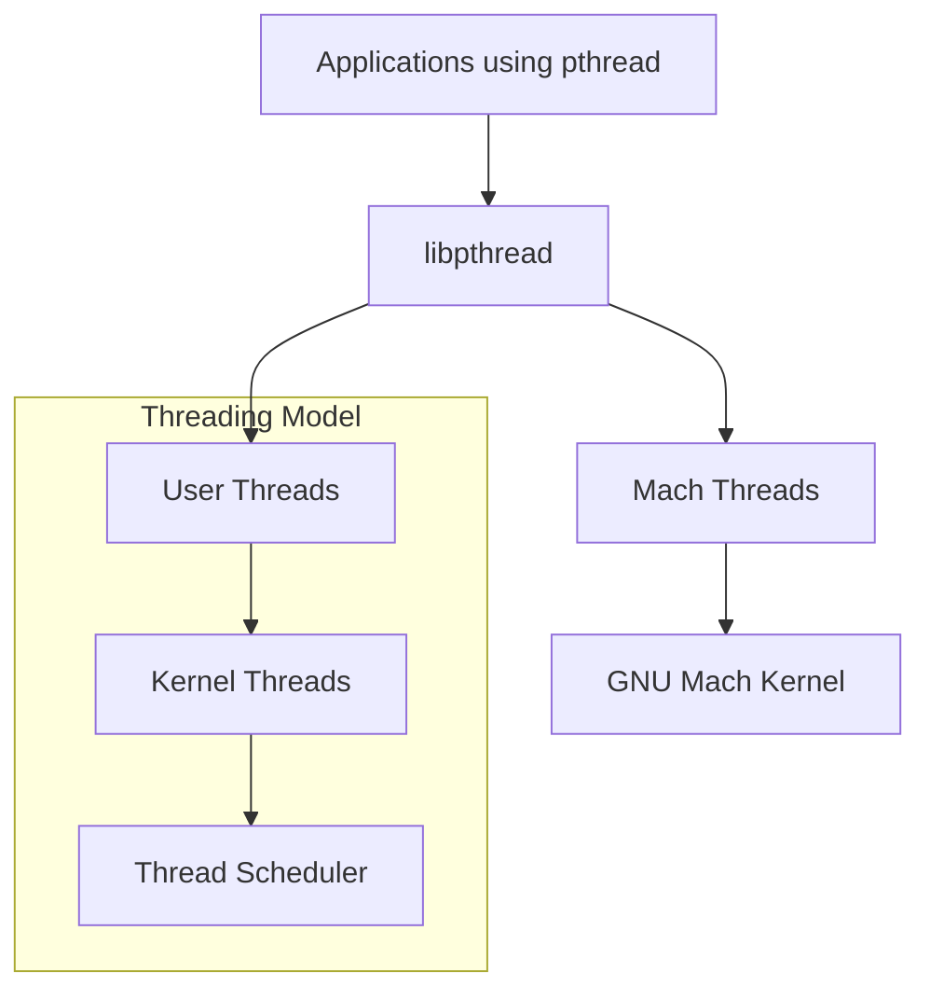

# Hurd Libraries

## Overview
Essential libraries that provide fundamental services for the Hurd ecosystem.

## Components

### libpthread
- **Purpose**: POSIX threading library implementation for Hurd
- **Source**: `https://git.savannah.gnu.org/git/hurd/libpthread.git`
- **Function**: Provides pthread API on top of Mach threads
- **Status**: Core component for multithreaded applications

## Library Architecture

## Related Libraries in Main Repository
The main repository already contains several important libraries:
- `libbpf` - BPF support
- `libcons` - Console support
- `libdiskfs` - Disk filesystem framework
- `libfshelp` - Filesystem helper functions
- `libhurd-slab` - Memory allocation
- `libihash` - Hash table implementation
- `libiohelp` - I/O helper functions
- `libmachdev` - Mach device support
- `libnetfs` - Network filesystem framework
- `libpager` - Memory paging support
- `libports` - Port management
- `libstore` - Storage abstraction
- `libtrivfs` - Simple filesystem framework

## Integration Notes
- libpthread will complement the existing library ecosystem
- Must ensure compatibility with existing threading in other libraries
- Build system integration required

## Development Priorities
1. Threading performance optimization
2. POSIX compliance improvements  
3. Integration with existing Hurd libraries
4. Memory management coordination