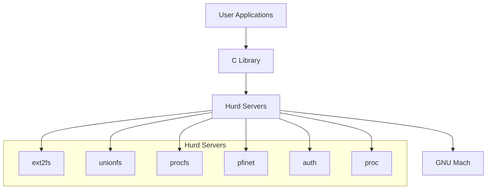

# Hurd Servers

## Overview
This directory contains the core Hurd servers that implement the system's functionality on top of the GNU Mach microkernel.

## Current Components

### unionfs
- **Purpose**: Union filesystem server
- **Function**: Combines multiple filesystems into a single namespace
- **Source**: `https://git.savannah.gnu.org/git/hurd/unionfs.git`

### procfs-upstream
- **Purpose**: Process filesystem (upstream version)
- **Function**: Provides `/proc` filesystem interface
- **Source**: `https://git.savannah.gnu.org/git/hurd/procfs.git`
- **Note**: There is also a local `procfs` in the repository root

## Server Architecture

## Server Types
- **Filesystem Servers**: ext2fs, unionfs, procfs, isofs, fatfs
- **Network Servers**: pfinet, pflocal
- **Authentication**: auth server
- **Process Management**: proc server
- **Device Servers**: Various hardware interfaces

## Development Guidelines
- Each server runs in user space
- Servers communicate via Mach IPC
- Servers can be started and stopped dynamically
- Privilege separation through capabilities

## Integration Status
- [ ] unionfs - **Pending network access**
- [ ] procfs-upstream - **Pending network access**