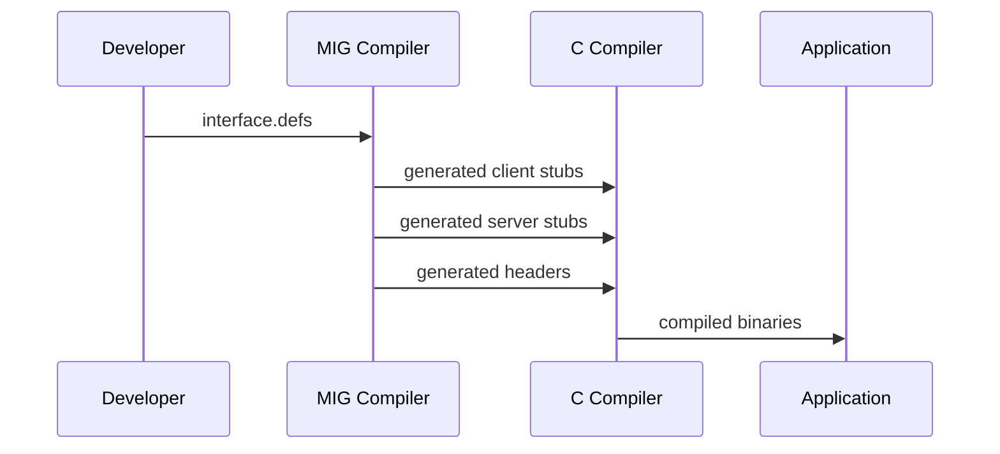

# Hurd Development Tools

## Overview
Essential tools for developing and building Hurd components.

## Components

### MIG (Mach Interface Generator)
- **Purpose**: Code generator for Mach IPC interfaces
- **Source**: `https://git.savannah.gnu.org/git/hurd/mig.git`
- **Function**: Generates C code from Mach interface definition files (.defs)
- **Critical Role**: Required for building all Hurd servers and libraries

## MIG Architecture and Workflow
```mermaid
graph LR
    A[Interface Definition<br/>(.defs file)] --> B[MIG Compiler]
    B --> C[Client Stub<br/>(C code)]
    B --> D[Server Stub<br/>(C code)]
    B --> E[Header Files<br/>(.h files)]
    
    subgraph "Generated Code Usage"
        F[Client Application] --> C
        G[Server Implementation] --> D
        H[Both] --> E
    end
```

## MIG Process Flow


## Interface Definition Example
```c
// Example .defs file structure
subsystem example 1000;

#include <mach/std_types.defs>

routine example_call(
    server_port : mach_port_t;
    in data : int;
    out result : int);
```

## Integration Requirements
- MIG must be built early in the build process
- All Hurd components depend on MIG-generated code
- Cross-compilation support needed
- Build system integration critical

## Development Tools Integration
- Works with existing Hurd build system (Makeconf, Makefile)
- Integrates with GNU autotools (configure.ac, aclocal.m4)
- Required for regenerating interface code

## Usage in Hurd Ecosystem
- **All servers** use MIG for IPC interfaces
- **All libraries** may include MIG-generated code
- **Build process** automatically invokes MIG when needed